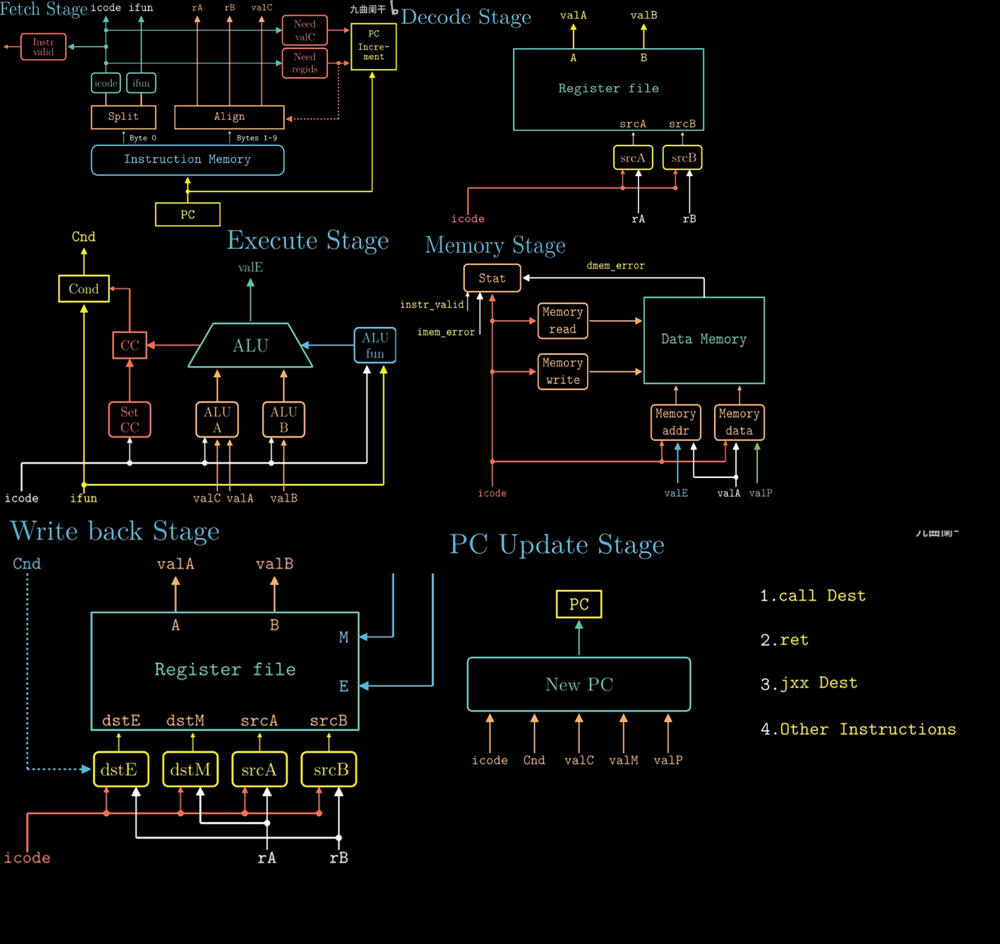

# Chapter 1 A Tour of Computer System

### Compilation System
    
Take C language as an example `linux > gcc hello.c -o hello`

- **Pre-processor** (cpp)   
    $\texttt{.c} \to \texttt{.i}$ Removal of comments & Header file inclusion & Macro expansion

- **Compiler** (cc1)   
    $\texttt{.i} \to \texttt{.s}$ Translates into assembly language

- **Assembler** (as)   
    $\texttt{.s} \to \texttt{.o}$ Generate relocatable object file

- **Linker** (ld) $\texttt{.o} \to \texttt{Executable}$ Combines codes with standard libraries

### Hardware Organization of a System


- **System Bus** 

    Transfer data in fixed-size blocks called words (4/8 bytes on a 32/64 bit system)

### Memory Hierarchy


### Abstractions in Computer Systems


- **Process & Thread**   
    Context switching with OS Kernel
- **Virtual Memory**  
    Program Code & Data, Shared Libraries, Heap, Stack, Kernel Virtual Memory from bottom to top
- **File**

### Amdahl's Law (Quantifying the performance improvement ceiling)

$T_{new} = (1 - \alpha) T_{old} + \frac{\alpha T_{old}}{k} = T_{old} (1 - \alpha + \frac{\alpha}{k})$

$S = \frac{T_{old}}{T_{new}} = \frac{1}{1 - \alpha + \frac{\alpha}{k}}$

# Chapter 2 Representing and Manipulating Information

## Information Storage

- **Words**

    $w$ word size $\Longleftrightarrow$ $[0,2^w)$ virtual address space

- **Addressing and Byte Ordering** Big endian & Little endian

## Integer Representaions

### Unsigned Encodings

Suppose a vector $\mathrm{x} = [x_{w - 1},x_{w - 2},\cdots,x_0]$, then $\operatorname{B2U_w}(x) = \sum \limits_{i = 0}^{w - 1}x_i \cdot 2^i$

### Two's Complement Encodings

Suppose a vector $\mathrm{x} = [x_{w - 1},x_{w - 2},\cdots,x_0]$, then $\operatorname{B2T_w}(x) = -x_{w - 1} \cdot 2^{w - 1} + \sum \limits_{i = 0}^{w - 2}x_i \cdot 2^i$

### Conversions between Signed and Unsigned

$$
\operatorname{T2U_w}(x) = 
\begin{cases}
x + 2^w,\quad x < 0 \\
x,\quad x \ge 0
\end{cases}
\quad
\operatorname{U2T_w}(u) = 
\begin{cases}
u,\quad x \le Tmax_w\\
u - w^w,\quad x > Tmax_w
\end{cases}
$$

### Sign Extension

#### Small to Big

    - Zero extension of unsigned numbers
    
    - Sign extension of two's complement numbers

        $\operatorname{B2T_w}([x_{w - 1},x_{w - 2},\cdots,w_0]) = \operatorname{B2T_{w + k}}([x_{w - 1},x_{w - 1},\cdots,x_{w - 1},x_{w - 1},x_{w - 2},\cdots,x_0])$

        Since $\operatorname{B2T_{w + 1}} -\operatorname{B2T_w} = (-x_{w - 1} \cdot 2^w + x_{w - 1} \cdot 2^{w - 1}) - x_{w - 1} \cdot 2^{w - 1} = 0$, by induction, we can proof it.

#### Big to Small

    - $\operatorname{B2U_{k}}(x) = \operatorname{B2U_{w}}(x) \bmod 2^k$

    - $\operatorname{B2T_{k}}(x) = \operatorname{U2T_{w}}(\operatorname{B2U_{w}}(x) \bmod 2^k)$

## Integer Arithmetic

### Addition

$$
x + y^u_w = 
\begin{cases}
x + y,\quad x + y < 2^w \\
x + y - 2^w,\quad 2^w \le x + y < 2^{w + 1}
\end{cases}
$$

$$
x + y^t_w = 
\begin{cases}
x + y - 2^w,\quad 2^{w - 1} \le x + y\\
x + y,\quad -2^{w - 1} \le x + y < 2^{w - 1} \\
x + y + 2^w,\quad x + y < -2^{w - 1}
\end{cases}
$$

### Additive Inverse

$x + x' = 0\ \text{or}\ 2^w$

$$
-x^u_w = 
\begin{cases}
x,\quad x = 0 \\
2^w - x,\quad x > 0
\end{cases}
\quad
-x^t_w = 
\begin{cases}
x,\quad x > Tmin_w \\
Tmin_w,\quad x = Tmin_w
\end{cases}
$$

### Multipilication

$$
x \times y^u_w = (x \cdot y) \bmod 2^k \\
x \times y^t_w = \operatorname{U2T_w}((x \cdot y) \bmod 2^k)
$$

### Division (by a power of 2)

Unsigned numbers use **logical shift**, while two's complement numbers use **arithmetic shift** to achieve sign-preserving extension.

Right shift performs integer division by powers of two : 

- $x \le 0 \quad x >> k = \lfloor \frac{x}{2^k} \rfloor$

- $x < 0 \quad (x + (1 << k) - 1) >> k = \lceil \frac{x}{2^k} \rceil$

## Floating Point

### Floating-Point Representation

$V = (-1)^s \times M \times 2^E$

s (sign) : The number is positive ($s=0$) or negative ($s=1$).

M (fraction) : A binary fraction.

E (exponent) : $2^E$ weight.


$\texttt{bias (float)} = 127 \quad \texttt{bias(double)} = 1023$ ($\texttt{bias} = 2^k - 1$)

#### Normalized 

exp is neither all 0s nor all 1s, i.e. $e \in [1,255]$

$E = e - \texttt{bias}$, 

$M = 1 + f$

#### Denormalized

$s = 0, f = 0 \rightarrow V = +0.0 \quad s = 1, f = 0 \rightarrow V = -0.0$

$E = 1 - \texttt{bias}$

$M = f$

#### Infinity

$s = 0, f = 0 \rightarrow V = +\infin \quad s = 1, f = 0 \rightarrow V = -\infin$

#### NaN (Not a Number)

$f \neq 0$

#### Comparison

|Format|Minimum|Maximum|
|:--:|:--:|:--:|
|Single Precision Normalized <br> $V = (-1)^s \times \overline{1.f} \times 2^{e - 127}$|$e = \texttt{00000001}$ <br> $E_{\min} = -126$ <br> $f = 0$ <br> $V = 1.0 \times 2^{-126}$|$e = \texttt{11111110}$ <br> $E_{\max} = 127$ <br> $f = 0.\underbrace{11\ldots 1}_{23\ \text{ones}}$ <br> $M = 1 + f = 1 + (1 - 2^{-23})$ <br>$V = 1.0 \times 2^{127} \times (2 - 2^{-23}) \approx 3.4 \times 10^{38}$|
|Double Precision Normalized <br> $V = (-1)^s \times \overline{0.f} \times 2^{-126}$|$e = \texttt{00000000}$ <br> $f = 2^{-23}$ <br> $V = 1.0 \times 2^{-149}$|$e = \texttt{00000000}$ <br> $f = 0.\underbrace{11\ldots 1}_{23\ \text{ones}}$ <br> $V = 1.0 \times 2^{-126} \times (1 - 2^{-23})$|

### Rounding

#### Round-down 

e.g. $1.40 \to 1 \quad -1.5 \to -2$

#### Round-up

e.g. $1.40 \to 2 \quad -1.5 \to -1$

#### Round-toward-zero

e.g. $1.40 \to 1 \quad -1.5 \to -1$

#### Round-to-even

e.g. $1.40 \to 1 \quad 1.6 \to 2 \quad 1.5 \to 2 \quad 2.5 \to 2$

- **Non-midpoint** round to the nearest representable value

- **Midpoint** choose the even one

### Floating Point Operations

Lack of Associativity & Lack of Distributivity

# Chapter 3 Machine-Level Representation of Programs

## Machine-Level Representation of Programs

### Size of Data Type in IA32

|C declaration|Intel data type|Assembly-code suffix|Size (bytes)|
|:--:|:--:|:--:|:--:|
|$\texttt{char}$|Byte|$\texttt{b}$|$1$|
|$\texttt{short}$|Word|$\texttt{w}$|$2$|
|$\texttt{int}$|Double word|$\texttt{l}$|$4$|
|$\texttt{long}$|Quad word|$\texttt{q}$|$8$|
|$\texttt{char *}$|Quad word|$\texttt{q}$|$8$|
|$\texttt{float}$|Single precision|$\texttt{s}$|$4$|
|$\texttt{double}$|Double precision|$\texttt{l}$|$8$|

### Register


### Information Access

#### Operands

- **Immediate**

- **Register**

- **Memory Reference** Immediate & Base Register & Index Register & Scale Factor (1,2,4,8)

|Type|Form|Operator Value|Name|
|:--:|:--:|:--:|:--:|
|Immediate|$\$Imm$|$Imm$|Immediate|
|Register|$r_a$|$R[r_a]$|Register|
|Memory|$Imm (r_b,r_i,s)$|$M[Imm + R[r_b] + R[r_i] \cdot s]$|Scaled Indexed|
|Memory|$Imm$|$M[Imm]$|Absolute|
|Memory|$(r_a)$|$M[R[r_a]]$|Indirect|
|Memory|$Imm (r_b)$|$M[Imm + R[r_b]]$|Base + Displacement|
|Memory|$(r_b,r_i)$|$M[R[r_b] + R[r_i]]$|Indexed|
|Memory|$Imm (r_b,r_i)$|$M[Imm + R[r_b] + R[r_i]]$|Indexed|
|Memory|$(,r_i,s)$|$M[R[r_i] \cdot s]$|Scale Indexed|
|Memory|$Imm(,r_i,s)$|$M[Imm + R[r_i] \cdot s]$|Scale Indexed|
|Memory|$(r_b,r_i,s)$|$M[R[r_b] + R[r_i] \cdot s]$|Scale Indexed|

#### Operation code

- **Movement** 

    - $\text{mov} \quad \text{S,D}$ [`movb`, `movw`, `movl`, `movq`, `movabsq`]

        Source operand (Immedita, Register, Memory); Destination operand (Register, Memory)

        Two operands of a move instruction **cannot** both be memory references. (It is necessary to first move the source memory reference into a register, and then move it to the destination memory reference.)

        `movl` writes 32 bits of data to the lower half and then automatically zero-extends the value into the upper 32 bits. (In x86-64, any instruction that generates a 32-bit result for a register will set the upper 32 bits of that register to zero.)

        `movq` can only be 32 bits (sign-extended to 64 bits), whereas `movabsq` can be 64-bit but the destination must be a **register**.

    - $\text{movz} \quad \text{S, R}$ [`movzbw`, `movzbl`, `movzwl`, `movzbq`, `movzwq`]

        `movzlq` does not exist because of `movl` instruction.

    - $\text{movs} \quad \text{S, R}$ [`movsbw`, `movsbl`, `movswl`, `movsbq`, `movswq`, `movslq`, `cltq`]
        
        `cltq` same as `movslq %eax, %rax`

- **Stack**

    let a quad number be the example

    - $\texttt{pushq} \quad S$ 

        ```assemblely
        subq $8 %rsp
        movq %rbq,(%rsp)
        ```
    
    - $\texttt{popq} \quad S$ 

        ```assemblely
        movq (%rsq),%rax
        addq $8, %rsp
        ```

### Arithmetic and Logical Operations

#### Load Effective Address

$\texttt{leaq} \quad S, D$ 

Computes effective address and stores it in destination register

#### Unary Operations

|Instructions|Effect|
|:--:|:--:|
|`inc D`|$D \gets D + 1$|
|`dec D`|$D \gets D - 1$|
|`neg D`|$D \gets -D$|
|`not D`|$D \gets \sim D$|

#### Binary Operations

|Instructions|Effect|
|:--:|:--:|
|`add S D`|$D \gets D + S$|
|`sub S D`|$D \gets D - S$|
|`imul S D`|$D \gets D \times S$|
|`xor S D`|$D \gets D \oplus S$|
|`or S D`|$D \gets D \mid S$|
|`and S D`|$D \gets D \mathbin{\&} S$|

#### Shift Operations

|Instructions|Effect|
|:--:|:--:|
|`sal D`|$D \gets D << k$|
|`shl D`|$D \gets D << k$|
|`sar D`|$D \gets D >>_A k$ Arithmetic Right Shift|
|`shr D`|$D \gets D >>_L k$ Logical Right Shift|

Shift instructions can shift by an immediate value, or by a value placed in the single-byte register `%cl`.

### Control

#### Condition Code

- $\texttt{CF}$ Carry Flag [check for overflow in unsigned operations]

- $\texttt{ZF}$ Zero Flag

- $\texttt{SF}$ Sign Flag

- $\texttt{OF}$ Overflow Flag

- $\texttt{cmp\quad S \quad D}$ 

    Similar to `sub`, but it only sets the condition codes without changing the value of the destination register.

    When `S == D`, $\texttt{ZF} = 1$.

    It will set the condition codes based on the result of $D - S$.

- $\texttt{test\quad S \quad D}$
    
    Similar to `and`, but it only sets the condition codes without changing the value of the destination register.

    When `S & D == 0`, $\texttt{ZF} = 1$.

#### Set Instructions

|Instruction|Effect|Description|
|:--:|:--:|:--:|
|`sete D`|$D \gets \texttt{ZF}$|$=$|
|`setne D`|$D \gets \sim \texttt{ZF}$|$\neq$|
|`sets D`|$D \gets \texttt{SF}$|negative|
|`setns D`|$D \gets \sim \texttt{SF}$|nonnegative|
|`setg D`|$D \gets \sim (\texttt{SF} \oplus \texttt{OF}) \mathbin{\&} \sim \texttt{ZF}$|Signed $>$|
|`setge D`|$D \gets \sim (\texttt{SF} \oplus \texttt{OF})$|Signed $\ge$|
|`setl D`|$D \gets \texttt{SF} \oplus \texttt{OF}$|Signed $<$|
|`setle D`|$D \gets (\texttt{SF} \oplus \texttt{OF}) \mid \texttt{ZF}$|Signed $\le$|
|`seta D`|$D \gets \sim \texttt{CF} \mathbin{\&} \sim \texttt{ZF}$|Unsigned $>$|
|`setae D`|$D \gets \sim \texttt{CF}$|Unsigned $\ge$|
|`setb D`|$D \gets \texttt{CF}$|Unsigned $<$|
|`setbe D`|$D \gets \texttt{CF} \mid \texttt{ZF}$|Unsigned $\le$|

#### Jump Instructions

|Instruction|Jump Condition|Description|
|:--:|:--:|:--:|
|`jmp Label`|$\mathrm{true}$|Direct Jump|
|`jmp *Operand`|$\mathrm{true}$|Indirect Jump|
|`je Label`|$\texttt{ZF}$|$=$|
|`jne Label`|$\sim \texttt{ZF}$|$\neq$|
|`js Label`|$\texttt{SF}$|Negative|
|`jns Label`|$\sim \texttt{SF}$|Nonnegative|
|`jg Label`|$\sim (\texttt{SF}\oplus \texttt{OF}) \mathbin{\&} \sim \texttt{ZF}$|Signed $>$|
|`jge Label`|$\sim (\texttt{SF}\oplus \texttt{OF})$|Signed $\ge$|
|`jl Label`|$\texttt{SF}\oplus \texttt{OF}$|Signed $<$|
|`jle Label`|$(\texttt{SF}\oplus \texttt{OF}) \mid \texttt{ZF}$|Signed $\le$|
|`ja Label`|$\sim \texttt{CF} \mathbin{\&} \sim \texttt{ZF}$|Unsigned $>$|
|`jae Label`|$\sim \texttt{CF}$|Unsigned $\ge$|
|`jb Label`|$\texttt{CF}$|Unsigned $<$|
|`jbe Label`|$\texttt{CF} \mid \texttt{ZF}$|Unsigned $\le$|

#### Conditional Move Instructions

|Instruction|Move Condition|Description|
|:--:|:--:|:--:|
|`cmove S, R`|$\texttt{ZF}$|$=$|
|`cmovne S, R`|$\sim \texttt{ZF}$|$\neq$|
|`cmovs S, R`|$\texttt{SF}$|Negative|
|`cmovns S, R`|$\sim \texttt{SF}$|Nonnegative|
|`cmovg S, R`|$\sim (\texttt{SF}\oplus \texttt{OF}) \mathbin{\&} \sim \texttt{ZF}$|Signed $>$|
|`cmovge S, R`|$\sim (\texttt{SF}\oplus \texttt{OF})$|Signed $\ge$|
|`cmovl S, R`|$\texttt{SF}\oplus \texttt{OF}$|Signed $<$|
|`cmovle S, R`|$(\texttt{SF}\oplus \texttt{OF}) \mid \texttt{ZF}$|Signed $\le$|
|`cmova S, R`|$\sim \texttt{CF} \mathbin{\&} \sim \texttt{ZF}$|Unsigned $>$|
|`cmovae S, R`|$\sim \texttt{CF}$|Unsigned $\ge$|
|`cmovb S, R`|$\texttt{CF}$|Unsigned $<$|
|`cmovbe S, R`|$\texttt{CF} \mid \texttt{ZF}$|Unsigned $\le$|

#### Loop

`do-while`, `while`, and `for` loops can be implemented by combining conditional tests and jumps.

#### Switch

`switch` is compiled into a jump table. The execution time of the switch statement is irrelevant to the number of cases.

### Procedures

#### Transfer Control
|Instruction|Description|
|:--:|:--:|
|`call Label`|Procedure Call (Direct)|
|`call *Operand`|Procedure Call (Indirect)|
|`ret`|Return from Procedure Call|

#### Data Transfer

The registers' names depend on the size of the data type being passed.

If a function has more than 6 integer parameters, the additional arguments must be passed on the **stack**. Note that the argument 7 is located at the top of the stack. All stack-passed arguments are aligned to multiples of 8 bytes.

### Array Allocation and Access

#### Pointer

| Expression   | Type  | Value                 | Assembly Code                  |
|--------------|-------|------------------------|--------------------------------|
| `E`          | `int*` | \( x_E \)             | `movq %rdx, %rax`              |
| `E[i]`       | `int`  | \( M[x_E + 4i] \)     | `movl (%rdx, %rcx, 4), %eax`   |
| `&E[i]`      | `int*` | \( x_E + 4i \)        | `leaq 8(%rdx, %rcx, 4), %rax`  |
| `&E[i] - E`  | `long` | \( i \)               | `movq %rcx, %rax`              |

**Notes**:

1. `&E[i] - E` yields type `long` (specifically `ptrdiff_t`) because pointer subtraction returns the number of elements between them as a signed integer.

2. `int*` uses `movq` (not `movl`) because pointers are 64-bit addresses in x86-64.

#### Nested Arrays

`T D[R][C]` $\&D[R][C] = x_D + L(C \cdot i + j)$, $L$ is the size of data type `T` in bytes.


### Struture & Union

#### Structure

|$K$|Types|
|:--:|:--:|
|$1$|$\texttt{char}$|
|$2$|$\texttt{short}$|
|$4$|$\texttt{int, float}$|
|$8$|$\texttt{long, double, char *}$|

**Notes**:

1. The address of any K-byte basic object must be a multiple of $K$.

2. The offset of the first member is always 0 in a structure.

3. The compilers probably add some bytes at the end of a structure to ensure that each element in an array of structures could satisfy its alignment requirements.

#### Union

The total size of a union equals the size of its largest field.

### Application

#### Buffer Overflow

Three protection mechanisms to thwart buffer overflow attacks:

- **Stack Randomization** Address-Space Layout Randomization (ASLR)

- **Stack Corruption Detection**  Place a random **canary** value between local buffers and critical stack data to detect buffer overflows.

- **Limiting Executable Code Regions**

#### Dynamic Stack Frame

`%rbp` is base pointer/frame pointer dynamic stack frame

### Floating-point Code

# Chapter 4 Processor Architecture

## Logic Design and Hardware Control Language (HCL)

### Logic Gate


### CMOS


### Process

$\texttt{Fetch} \to \texttt{Decode} \to \texttt{Execute} \to \texttt{Memory} \to \texttt{Write Back} \to \texttt{Update}$

For Y86-84 :



1. Fetch

    - Read instruction bytes from memory using PC:
        - `icode:ifun` (instruction specifier)
        - `rA, rB` (register specifiers)
        - `valC` (8-byte constant)
    - Compute next instruction address → `valP`

2. Decode

    - Read up to two operands from registers
    - `rA, rB` → `valA, valB`
    - For `popq`, `pushq`, `call`, `ret`: also read from `%rsp`

3. Execute

    - Compute (ALU/address/stack) → `valE`
    - Set condition codes
    - Conditional moves: check CC, update dest register
    - Jumps: decide branch

4. Memory

    - Write to memory
    - Read from memory → `valM`

5. Write Back

    - Write up to two results to registers

6. Update

    - Set PC to next instruction address

### Pipelining

- **Throughput** 
    the number of instructions in one second.

    GIPS: Giga-Instructions Per Second

- **Circuit Retiming**

    Repositions registers within a design to optimize performance or area, without altering the system’s input/output behavior. It changes the state encoding by moving delays (registers) across combinational logic elements.


### Hazards

The dependency between instructions may lead to incorrect computation results.

#### Data Hazards

- **Stalling** 

    **Stalling** prevents data hazards by pausing the pipeline until required operands are ready. This approach is simple but reduces performance.

- **Data Forwarding** (**Bypassing**)

    **Data forwarding** allows a result computed in a later pipeline stage to be passed directly to an earlier stage as a source operand.

- **Load/Use Hazards**

    A **load/use hazards** occurs when an instruction requires a value that is still being loaded from memory by the previous instruction. Since the memory read completes late in the pipeline, forwarding cannot resolve the dependency in time, causing a stall.

#### Control Hazards

**Control hazards** occur when the processor cannot determine the next instruction's address during the fetch stage. In a pipelined processor, this typically happens for `ret` instructions and mispredicted conditional jumps.

- `ret` Inserting bubbles to wait for the return address to be determined.

- **Conditional Jump** Branch mispredictions are handled by cancelling the erroneously fetched instructions through the insertion of pipeline bubbles (or via instruction squashing) in the decode and execute stages.

### Pipelined Y86-64 Implementations

#### Fetch Stage

1. Sequential Execution

`halt`, `nop`, `rrmovq`, `irmovq` , `mrmovq`, `Opq`, `pushq`, `popq`, `covXX`, `addq`

2. Jump Execution

`call`, `jxx` (The Select PC mechanism is employed to correct branch mispredictions.)

3. `ret`

#### Decode Stage

The selection logic chooses between the merged `valA`/`valP` signals and one of five forwarding sources (`e_valE`, `m_valM`, `M_valE`, `W_valM`, or `W_valE`) based on the instruction type and hazard detection. If no forwarding is triggered, `d_rvalA` (the register file read) is used as the default value.


### Pipeline Control Logic

- **Stall** 

    Keep the state of the pipeline registers unchanged. When the stall signal is set to 1, the register will retain its previous state.

- **Insert Bubbles** 

    Setting the state of the pipeline registers to a value equivalent to a `nop` instruction. When the bubble signal is set to 1, the state of the register will be set to a fixed reset configuration.

#### Load/Use Data 

A one-cycle pipeline stall is required between an instruction that reads a memory value in the execute stage and a subsequent instruction that uses that value in the decode stage.

#### Mispredicted Branches

When a branch is mispredicted as taken, the pipeline must squash the incorrectly fetched instructions from the target path and redirect fetching to the correct fall-through address.

#### Processing `ret`

The pipeline must stall until the `ret` instruction reaches the write-back stage.

#### Exception Handling

When an instruction triggers an exception, all subsequent instructions must be prevented from updating programmer-visible state, and execution must halt once the exception-causing instruction reaches the write-back stage.

| Condition            | F       | D       | E       | M       | W       |
|----------------------|---------|---------|---------|---------|---------|
| Handling `ret`       | Stall   | Bubble  | Normal  | Normal  | Normal  |
| Load/Use Hazard      | Stall   | Stall   | Bubble  | Normal  | Normal  |
| Mispredicted Branch  | Normal  | Bubble  | Bubble  | Normal  | Normal  |