# CSC3060 Introduction to Computer Systems

- **Textbook** *Computer Systems A Programmer’s Perspective, 3e, INTERNATIONAL EDITION* written by Randal Bryant and David R. O'Hallaron.

- **Reference book** *Computer Organization and Design: The Hardware/Software Interface (RISC-V Edition)* written by David A. Patterson and John L. Hennessy.

# Chapter 1 A Tour of Computer System

Computer system is a combination of hardware components and systems software that work together to run application programs.

### Compilation System
    
Take C language as an example `linux > gcc hello.c -o hello`.

- **Pre-processor** (cpp) $\texttt{.c} \to \texttt{.i}$ Handles include/define, strips off comments and conditional compilation #ifdef
- **Compiler** (cc1) $\texttt{.i} \to \texttt{.s}$ Scan/parse/semantic check/code gen/opt
- **Assembler** (as) $\texttt{.s} \to \texttt{.o}$ From assembly to machine code
- **Linker** (ld) $\texttt{.o} \to \texttt{Executable}$ Relocation & reference resolution

### Hardware Organization of a System


DMA (Direct Memory Access) is usually used for high-spped and bulk data transfers, controlled by system programmers.

- **System Bus** 

    Transfer data in fixed-size blocks called words (4/8 bytes on a 32/64 bit system)

### Memory Hierarchy


The localities of cache: **Temporal Locality** & **Spatial Locality**.

### Abstractions in Computer Systems (Virtualization)


Virtualization is often related to multiplicity, fake versions, and sharing.

- **Process & Thread**

    Multiple processes can run concurrently on the same system, and each process appears to have exclusive use of the hardware. 
    
    Context switching with OS Kernel.

    A process can actually consist of multiple execution units, called threads. Threads shares the same code and global data.

- **Virtual Memory**

    Virtual memory is an abstraction that gives each program its own private, continuous address space, while the OS and hardware (MMU/TLB) map those virtual addresses to physical memory (or disk via paging) to provide isolation, security, and the illusion of more memory than physically available.

    Program Code & Data, Shared Libraries, Heap, Stack, Kernel Virtual Memory from bottom to top.
    
    - Virtual address space canve greater than the  physical memory.

    - Memory serves as a cache for virtaul memory.

    - Support multiprogramming.

    - Allow multiple processes to share data.

- **File**

### Import Themes

#### Amdahl's Law (Quantifying the performance improvement ceiling)

$T_{new} = (1 - \alpha) T_{old} + \frac{\alpha T_{old}}{k} = T_{old} (1 - \alpha + \frac{\alpha}{k})$

$S = \frac{T_{old}}{T_{new}} = \frac{1}{1 - \alpha + \frac{\alpha}{k}}$

#### Concurrency and Parallelism

- **Concurrency** It refers to the general concept of a system having multiple, simultaneous activities, which do not necessarily execute at the same time, but may interleave in time to create the logical impression of simultaneity.

- **Parallelism** It refers to the use of concureency to make a system run faster.

#### ILP and DLP

- **Instruction-Level** e.g. Parallelism pipelining, superscalar, out-of-order execution.

- **Data-Level Parallelism** e.g. Single Insruction Multiple Data (SIMD), Vector instructions.

### Computer Architecture

Computer Architecture (e.g. Intel x86, IBM 360, ARM, RISC-V) is **the interface between hardware and software**, it includes ISA and Microarchitectures (parallel processing techniques (e.g. Pipelining, Multi-threading, Multi-Processing, Superscalar) and Memory hierarchy (e.g. Local memory and caches / Registers, vector registers, SIMD registers)).

# Chapter 2 Representing and Manipulating Information

## Information Storage

- **Words**

    $w$ word size $\Longleftrightarrow$ $[0,2^w)$ virtual address space

- **Addressing and Byte Ordering** 

    Big endian (e.g. IBM Mainframes) & Little endian (e.g. Intel x86, ARM, RISC-V).
    
    Big-endian means most significant byte first, and Little-endian means least significant byte first. 

## Integer Representaions

### Sizes of Data Type in C/C++

|Signed|Unsigned|32-bit (Bytes)|64-bit (Bytes)|
|:--:|:--:|:--:|:--:|
|$\texttt{[signed] char}$|$\texttt{unsigned char}$|1|1|
|$\texttt{short}$|$\texttt{unsigned short}$|2|2|
|$\texttt{int}$|$\texttt{unsigned}$|4|4|
|$\texttt{long}$|$\texttt{unsigned long}$|$\color{red}\textbf{4}$|$\color{red}\textbf{8}$|
|$\texttt{int32{\_}t}$|$\texttt{uint32{\_}t}$|4|4|
|$\texttt{int64{\_}t}$|$\texttt{uint64{\_}t}$|8|8|
|$\texttt{char *}$|—|$\color{red}\textbf{4}$|$\color{red}\textbf{8}$|
|$\texttt{float}$|—|4|4|
|$\texttt{double}$|—|8|8|

### Unsigned Encodings

Suppose a vector $\mathrm{x} = [x_{w - 1},x_{w - 2},\cdots,x_0]$, then $\operatorname{B2U_w}(x) = \sum \limits_{i = 0}^{w - 1}x_i \cdot 2^i$

### Two's Complement Encodings

><strong>Inverse form (1's Complement)</strong> For a negative number, keep the signed the same and invert the rest.<br> two zero exits & end-round carry out issues (hte end carry-out bit needs to add back to the LSB)
<br><br>
<strong>2's Complement</strong> For a negative number, keep the sign the same, invert the rest and add 1.

Suppose a vector $\mathrm{x} = [x_{w - 1},x_{w - 2},\cdots,x_0]$, then $\operatorname{B2T_w}(x) = -x_{w - 1} \cdot 2^{w - 1} + \sum \limits_{i = 0}^{w - 2}x_i \cdot 2^i$

### Conversions between Signed and Unsigned

$$
\operatorname{T2U_w}(x) = 
\begin{cases}
x + 2^w,\quad x < 0 \\
x,\quad x \ge 0
\end{cases}
\quad
\operatorname{U2T_w}(u) = 
\begin{cases}
u,\quad x \le Tmax_w\\
u - w^w,\quad x > Tmax_w
\end{cases}
$$

For a $n$-bit 2's complemetn signed binary numeral system:

- Minimum $-2^{n - 1}$, corresponding to binary $\texttt{100} \cdots \texttt{0}$ (A special case that does not satisfy the **invert bits and add 1** rule used for other negative numbers).
- Maximum $2^{n - 1} - 1$, corresponding to binary $\texttt{011} \cdots \texttt{1}$.

### Sign Extension

#### Small to Big

- Zero extension of unsigned numbers

- Sign extension of two's complement numbers

    $\operatorname{B2T_w}([x_{w - 1},x_{w - 2},\cdots,w_0]) = \operatorname{B2T_{w + k}}([x_{w - 1},x_{w - 1},\cdots,x_{w - 1},x_{w - 1},x_{w - 2},\cdots,x_0])$

    Since $\operatorname{B2T_{w + 1}} -\operatorname{B2T_w} = (-x_{w - 1} \cdot 2^w + x_{w - 1} \cdot 2^{w - 1}) - x_{w - 1} \cdot 2^{w - 1} = 0$, by induction, we can proof it.

#### Big to Small

- $\operatorname{B2U_{k}}(x) = \operatorname{B2U_{w}}(x) \bmod 2^k$

- $\operatorname{B2T_{k}}(x) = \operatorname{U2T_{w}}(\operatorname{B2U_{w}}(x) \bmod 2^k)$

## Integer Arithmetic

### Addition

$$
x + y^u_w = 
\begin{cases}
x + y,\quad x + y < 2^w \\
x + y - 2^w,\quad 2^w \le x + y < 2^{w + 1}
\end{cases}
$$

$$
x + y^t_w = 
\begin{cases}
x + y - 2^w,\quad 2^{w - 1} \le x + y\\
x + y,\quad -2^{w - 1} \le x + y < 2^{w - 1} \\
x + y + 2^w,\quad x + y < -2^{w - 1}
\end{cases}
$$

### Additive Inverse

$x + x' = 0\ \text{or}\ 2^w$

$$
-x^u_w = 
\begin{cases}
x,\quad x = 0 \\
2^w - x,\quad x > 0
\end{cases}
\quad
-x^t_w = 
\begin{cases}
x,\quad x > Tmin_w \\
Tmin_w,\quad x = Tmin_w
\end{cases}
$$

- For two numbers A, B, the overflow occurs when `(NOT (sign_A XOR sign_B)) AND (sign_A XOR new_sign) == 1`. (Two operands have the same sign but the result has a different sign.)

- One Bit Full Adder 

    $S_i = A_i + B_i + \text{carry\_in} \quad \text{carry\_out} = (A_i \& B_i) | (\text{carry\_in} \& (A_i \oplus B_i))$

- Carry Lookahead Adder 
    
    $$
    \begin{cases}
    g_i = (A_i \cdot B_i) \\
    p_i = (A_i \oplus B_i) \\
    C_1 = g_0 + (p_0 \cdot C_0) \\
    C_2 = g_1 + (p_1 \cdot g_0) + (p_1 \cdot p_0 \cdot C_0) \\
    C_3 = g_2 + (p_2 \cdot g_1) + (p_2 \cdot p_1 \cdot g_0) + (p_2 \cdot p_1 \cdot p_0 \cdot C_0) \\
    \vdots
    \end{cases}
    $$

    

### Multipilication

$$
x \times y^u_w = (x \cdot y) \bmod 2^k \\
x \times y^t_w = \operatorname{U2T_w}((x \cdot y) \bmod 2^k)
$$

### Division (by a power of 2)

Unsigned numbers use **logical shift**, while two's complement numbers use **arithmetic shift** to achieve sign-preserving extension.

Right shift performs integer division by powers of two : 

- $x \le 0 \quad x >> k = \lfloor \frac{x}{2^k} \rfloor$

- $x < 0 \quad (x + (1 << k) - 1) >> k = \lceil \frac{x}{2^k} \rceil$

## Floating Point

### Floating-Point Representation

$V = (-1)^s \times M \times 2^E$

s (sign) : The number is positive ($s=0$) or negative ($s=1$).

M (fraction) : A binary fraction.

E (exponent) : $2^E$ weight.

$\texttt{bias (float)} = 127 \quad \texttt{bias(double)} = 1023$ ($\texttt{bias} = 2^{k - 1} - 1$)

|Category|Exponent $e$|Fraction $f$|Value Formula|
|:--:|:--:|:--:|:--:|
|Normalized|$1 \le e \le 254$|any|$V = (-1)^s \times (f{\color{red} + 1}) \times 2^{\color{red}{e - 127}}$|
|Denormalized|$e = 0$|$f \neq 0$|$V = (-1)^s \times f \times 2^{\color{red}{-126}}$|
|Zero|$e = 0$|$f = 0$|$V = \pm 0.0$|
|Infinity|$e = 255$|$f = 0$|$V = \pm \infty$|
|NaN (Not a Number) |$e = 255$|$f \neq 0$|`NaN`|

When interpreted as signed integers, the bit representation of IEEE 754 floating-point numbers (excluding `NaN`) preserves the same sorting order.

#### Comparison (postive number)

|Format|Minimum|Maximum|
|:--:|:--:|:--:|
|Single Precision Normalized <br> $V = (-1)^s \times \overline{1.f} \times 2^{e - 127}$|$e = \texttt{00000001}$ <br> $E_{\min} = -126$ <br> $f = 0$ <br> $V = 1.0 \times 2^{-126}$|$e = \texttt{11111110}$ <br> $E_{\max} = 127$ <br> $f = 0.\underbrace{11\ldots 1}_{23\ \text{ones}}$ <br> $M = 1 + f = 1 + (1 - 2^{-23})$ <br>$V = 1.0 \times 2^{127} \times (2 - 2^{-23}) \approx 3.4 \times 10^{38}(\texttt{0x7F7FFFFF})$|
|Single Precision Denormalized <br> $V = (-1)^s \times \overline{0.f} \times 2^{-126}$|$e = \texttt{00000000}$ <br> $f = 2^{-23}$ <br> $V = 1.0 \times 2^{-149}(\texttt{0x00800000})$|$e = \texttt{00000000}$ <br> $f = 0.\underbrace{11\ldots 1}_{23\ \text{ones}}$ <br> $V = 1.0 \times 2^{-126} \times (1 - 2^{-23})$|

#### Rounding

|Round-down|Round-up|Round-toward-zero|Round-to-even|
|:--:|:--:|:--:|:--:|
|$1.40 \to 1$<br>$-1.5 \to -2$|$1.40 \to 2$<br>$-1.5 \to -1$|$1.40 \to 1$<br>$-1.5 \to -1$|$1.40 \to 1$<br>$1.6 \to 2$<br>$1.5 \to 2$<br>$2.5 \to 2$<br>**Non-midpoint** round to the nearest representable value<br>**Midpoint** choose the $\color{red}\textbf{even}$ one|

#### Floating Point Operations

- **Lack of Associativity & Lack of Distributivity**

    <details><summary>Example Questions</summary>

    Let $x,f,d$ are of type `int`, `float`, `double` (Their values are arbitrary, except that neither $f$ nor $d$ equals $+\infty$, $-\infty$, or $\texttt{NaN}$.). Then:

    - `x == (int)(double) x` True
    - `x == (int)(float) x` False $2^{24} - 1 \to (1 + 0.\underbrace{11\ldots 1}_{23\ \text{ones}}) \times 2^{23}$ (e.g. $16777217$)
    - `d == (double)(float) d` False (e.g. $1.234$)
    - `f == (float)(double) f` True
    - `d*d >= 0.0` True

    </details>

- **Float Point Addition**

    - Align decimal points (small to big)
    - Add significands
    - Normalize
    - Round and renormalize if needed
    
    <details> <summary> Example </summary>

    $$
    \begin{align*}
    & 9.999 \times 10^1 + 1.610 \times 10^{–1} \\
    &= 9.999 \times 10^1 + 0.01610 \times 10^1 \\
    &= 10.015 \times 10^1 = 1.0015 \times 10^2 \\
    &= 1.002 \times 10^2
    \end{align*}
    $$
    
    </details>


#### Precision (IEEE 754-2008 Standard Formats)

| Format | Sign Bits | Exponent Bits | Mantissa Bits |
|:--:|:--:|:--:|:--:|
| Quad precision | 1 | 15 | 112 |
| Double precision | 1 | 11 | 52 |
| Single precision (FP32) | 1 | 8 | 23 |
| Half precision (FP16) | 1 | 5 | 10 |

<details><summary><strong>bfloat16</strong></summary>

- The format is 1 sign, 8 exponent, 7 mantissa bits, Same exponent range as FP32.
- AI/LLM is based on predictions, approximation does not require high precision.Therefore reduced precision is acceptable for AI.  
- Lower precision format enables higher memory bandwidth and computational. bandwidth.
</details>

#### FMA/FMAC

Fused Multiply and Add (FMA) or Fused Multiply and Accumulate (FMAC) combines multiply and add in one instruction ($A \times B + C$).

- Multiplication and addition are parallel.
- Normalization and rounding are combined at the end.

Use `-mfma -ffp-contract=fast` to enable FMA.

# Chapter 3 Machine-Level Representation of Programs

## Machine-Level Representation of Programs

### RISC [optimized for processor speed]

#### Principles

1. Simplicity favors regularity
2. Smaller is faster
3. Make common cases fast
4. Good design demands good compromises

[RSA should be scalable, flexible, and extensible.]

#### Variants of RV 

- **RV32, RV64, RV128** Different data widths (addressing capability)

|Extension|Description|
|:--:|:--:|
|I|Base integer instructions|
|E|Base for embedded systems (e.g., only 16 registers)|
|M|Integer multiplication and division|
|A|Atomic memory instructions|
|C|Compressed extension (16-bit instructions)|
|F|Single-precision floating point|
|D|Double-precision floating point|
|V|Vector extension|

#### Instruction Types in RV32I


|Types|Instructions|
|:--:|:--:|
|ALU|`add`, `sub`, `and`, `or`, `xor`, `slt`, `sltu`, `sll`, `srl`, `sra`, and all with immediate (No `subi` in RV32I)|
|Control Instructions|`beq`, `bne`, `blt`, `bge`, `bltu`, `bgeu`, `jal`, `jalr`|
|Memory Instructions|`lw` (No `lwu` in RV32I), `lh`, `lb`, `sw`, `sh`, `sb`, `lbu`, `lhu`|
|Privileged Instructions|Interrupt, Memory Management, System Calls, Control and Status Registers (CSR), Mode Change|


| Format | Name | Instructions |
|--------|------|--------------|
| **R-type** | Register | `add`, `sub`, `sll`, `srl`, `sra`, `xor`, `or`, `and` |
| **I-type** | Immediate | `addi`, `slli`, `srli`, `srai`, `xori`, `ori`, `andi` |
| **I-type** | Load | `lb`, `lh`, `lw`, `lbu`, `lhu` |
| **I-type** | Jump and Link Register | `jalr` |
| **S-type** | Store | `sb`, `sh`, `sw` |
| **B-type** | Branch | `beq`, `bne`, `blt`, `bge`, `bltu`, `bgeu` |
| **U-type** | Upper Immediate | `lui`, `auipc` |
| **UJ-type** | Unconditional Jump | `jal` |

- Three operand instruction format. 
- X0 is always zero.
- 32 means Address cability/Integer register length.
- Immediate

    - **$\texttt{R}$ type** No immediate.
    - **$\texttt{B,I}$ type** 12 bits immediate. Shift instructions are I-type but repurpose the immediate field as a 5-bit shift amount for RV32I (6-bit for RV64I). `inst[30]` distinguishes arithmetic from logical right shift, while `inst[31:26]` are fixed to zero except `inst[30]` (Range: $\pm 4\text{KB}$). The immediate in the **branch** instruction is an offset relative to PC.
    - **$\texttt{S}$ type** The 12‑bit immediate is split into high 7 bits (immediate) and low 5 bits (immed) (maintain regularity). The immediate in the **store** instruction is an offset relative to `rs1`.
    - **$\texttt{J}$ type** 20 bits immediate.
- Jump
    - `jal`

        - $rd \leftarrow PC + 4$, $PC \leftarrow PC + \text{sign-extend}(\{\text{inst}[31], \text{inst}[19:12], \text{inst}[20], \text{inst}[30:21]\})\times 2$ (Jumps are 2-byte aligned, so last bit is implicit zero).
        - Range: $\pm 1\text{MB}$.
        - Beyond 1MB: Use **AUIPC + JALR**.
    - `jalr`

        - $rd \leftarrow PC + 4$, $PC \leftarrow (rs1 + \text{sign-extend}(\text{inst}[31:20])) \ \&\ \sim 1$ ($\sim 1$ clears LSB to ensure 2‑byte alignment). 
- Load and Store

    `lw rd, offset (rs1)` means load data from memory and write into `rd`.

    `sw rs2, offset (rs1)` means store data from register `rs2` into memory.
- LUI loads a 20‑bit immediate into the upper bits of a register; AUIPC adds a 20‑bit immediate to the current PC for position‑independent addressing. 
  <details> <summary>How to load a 32b const into a register?</summary>
  
    1. Use a LW instruction (cost more)
    2. `lui` and `addi` (When the lower 12 bits of a 32‑bit constant are $\ge \texttt{0x800}$, `addi` sign‑extends them, causing an incorrect result. The assembler automatically adjusts the upper 20 bits when using the `li` pseudo‑instruction.) (Range: $4\text{GB}$)

    </details>

<details> <summary><strong>Instruction Encoding List</strong></summary>

<div style="display: grid; grid-template-columns: 1fr 1fr; gap: 10px;">
  <div style="align-self: stretch;">
    
  </div>
  <div style="display: flex; flex-direction: column; gap: 10px;">
    <div style="flex: 1; display: flex; align-items: flex-start;">
      
    </div>
    <div style="flex: 1; display: flex; align-items: flex-end;">
      
    </div>
  </div>
</div>

</details>

<details><summary><strong>Regularity</strong></summary>
  
| Field | Bit Position | Note |
| :---: | :---: | :---: |
| **Opcode** | $[0,6]$ | Always opcode |
| **rd** | $[7,11]$ | Destination reg |
| **rs1** | $[15,19]$ | Source reg 1 |
| **rs2** | $[20,24]$ | Source reg 2 |
| **Length** | - | Fixed 16/32 bit |
| **Immediate** | High bits | Uses rd field for branch/store |
</details>

<details><summary><strong>Pseudo Instrcution</strong></summary>

| Pseudoinstruction | Actual Instruction Sequence | Operation |
|-------------------|----------------------------|-----------|
| `nop` | `addi x0, x0, 0` | No operation |
| `li rd, imm` | `lui rd, imm[31:12] + imm[11]`<br>`addi rd, rd, imm[11:0]` | Load 32-bit immediate |
| `mv rd, rs` | `addi rd, rs, 0` | Copy register |
| `not rd, rs` | `xori rd, rs, -1` | Bitwise NOT |
| `neg rd, rs` | `sub rd, x0, rs` | Two's complement negation |
| `seqz rd, rs` | `sltiu rd, rs, 1` | Set if $= 0$ |
| `snez rd, rs` | `sltu rd, x0, rs` | Set if $\neq 0$ |
| `sltz rd, rs` | `slt rd, rs, x0` | Set if $< 0$ |
| `sgtz rd, rs` | `slt rd, x0, rs` | Set if $> 0$ |
| `beqz rs, offset` | `beq rs, x0, offset` | Branch if $= 0$ |
| `bnez rs, offset` | `bne rs, x0, offset` | Branch if $\neq 0$ |
| `blez rs, offset` | `bge x0, rs, offset` | Branch if $\le 0$ |
| `bgez rs, offset` | `bge rs, x0, offset` | Branch if $\ge 0$ |
| `bltz rs, offset` | `blt rs, x0, offset` | Branch if $< 0$ |
| `bgtz rs, offset` | `blt x0, rs, offset` | Branch if $> 0$ |
| `bgt rs, rt, offset` | `blt rt, rs, offset` | Branch if $rs > rt$ |
| `ble rs, rt, offset` | `bge rt, rs, offset` | Branch if $rs \le rt$ |
| `bgtu rs, rt, offset` | `bltu rt, rs, offset` | Branch if unsigned $rs > rt$ |
| `bleu rs, rt, offset` | `bgeu rt, rs, offset` | Branch if unsigned $rs \le rt$ |
| `j offset` | `jal x0, offset` | Unconditional jump |
| `jal offset` | `jal x1, offset` | Jump and link (return address in `x1`) |
| `jr rs` | `jalr x0, 0(rs)` | Jump to address in `rs` |
| `jalr rs` | `jalr x1, 0(rs)` | Jump and link to address in `rs` |
| `ret` | `jalr x0, 0(x1)` | Return from subroutine |
| `call offset` | `auipc x1, offset[31:12] + offset[11]`<br>`jalr x1, offset[11:0](x1)` | Far call to subroutine |

</details>

<details><summary>Why do RISC-V loads/stores use <code>base+immediate</code> instead of <code>base+index</code>?</summary>

- **Simpler hardware** Adding scaling to load instructions requires a shifter and complicates the address calculation datapath, increasing cost and cycle time.
- **ISA regularity violation** Three operands `(rs1, rs2, rd)` would force an R‑type format, but R‑type is reserved for ALU operations only. Mixing in memory access would break the clean encoding scheme.
- **Compiler can optimize it away** In loops, the compiler just increments the base register by the element size each iteration, making scaled indexing unnecessary.

</details>

<details><summary>Why do RISC-V instructions place immediate bits in seemingly "random" positions (e.g., B-Type and J-Type)?</summary>

- Fixed sign bit at position 31 across all formats.
- Decoder reuse (B-Type reuses S-Type logic, J-Type reuses U-Type logic).
- Fixed register fields (`rs1`, `rs2`, `rd`) across formats.
</details>

#### Application Binary Interface (ABI)

It is based on three key components : **the computer ISA, the OS, and the calling convention**. ABI incompatibility will occur due to differences between operating systems.

#### Data Alignment

- No cache line crossing; no double TLB (Translation Lookaside Buffer) misses; no double page faults come from a single memory instruction execution. 

- Better cache line utilization.

RISC-I to RISC-V **do not** explicitly enforce data alignments. But their compilers often enforce data alignments.

**Crossing a boundary makes the memory reference difficult to handle.** The hardware needs to go through two exceptions instead of one.

**Padding Rule**
- Internal Padding Every member must start at an address that is a multiple of its own alignment requirement.
- Trailing Padding The total size of the struct must be a multiple of the largest alignment requirement among its members.

<details><summary>Exercise</summary>

```c
struct S1 {
    int white;
    long long count;
    char c;
    int red;
    int blue;
} A[];
```
Suppose $A$ is an array of structure $S1$, and the starting address of $A$ is stored in register $X1$. what instruction should be used to access `A[100].red`?

| Member | Size | Start | Padding | End | Reason |
|--------|------|-------|---------|-----|--------|
| `white` | $4$ | $0$ | $0$ | $3$ | `int` aligns at $4$ |
| `count` | $8$ | $8$ | $+4$ | $15$ | needs 8-byte align, $4$ pad $4$ to $8$ |
| `c` | $1$ | $16$ | $0$ | $16$ | `char` aligns at $1$ |
| `red` | $4$ | $20$ | $+3$ | $23$ | needs 4-byte align, $17$ pad $3$ to $20$ |
| `blue` | $4$ | $24$ | $0$ | $27$ | `int` aligns at $4$ |

Current size is $28$. Largest alignment in struct is $8$, $28$ is not a multiple of $8$, so pad $4$ bytes at the end. Total struct size is $32$ bytes.

`A[100].red` : $X1 + 100 \times 32 + 20 = X1 + 3220$, so the answer is `LW X2, 3220(X1)`.

</details>

#### Stack / Frame Alignments

- Defined by ABI (e.g., RISC‑V psABI: 16‑byte)
- CRT aligns `sp` before `main ()`

#### Compiler Reordering

- Independent Variables (Rearrangement Allowed)

- Struct Fields (Rearrangement Forbidden)
    - Binary compatibility
    - Pointer arithmetic
    - Interoperability

#### PC-relative Addressing

Branch instructions use PC‑relative addressing with a 12‑bit signed offset (in 2‑byte units). Since branch targets are always multiples of 2, encoding in 2‑byte units doubles the reachable range without losing information.

$$
\text{Target Address} = \text{PC} + \text{sign\_extend}(12\text{-bit immediate}) \times 2
$$

#### CSR

| Name | Abbreviation | Description |
|------|--------------|-------------|
| Machine Trap-Vector Base-Address Register | `mtvec` | Exception handler entry address |
| Machine Status Register | `mstatus` | Global interrupt enable (MIE) and status |
| Machine Cause Register | `mcause` | Reason of last exception/interrupt |
| Machine Exception Program Counter | `mepc` | Saves PC when exception occurs |
| Machine Interrupt Enable Register | `mie` | Enables specific interrupt sources |
| Machine Interrupt Pending Register | `mip` | Shows pending interrupts |

#### Exception Handling

1. **Save context** Save current PC value to `mepc` register
2. **Update status** Update `mstatus`, disable further interrupts (clear MIE bit) to prevent nesting
3. **Set cause** Write exception/interrupt reason to `mcause`
4. **Jump to handler** Jump to exception handler entry point based on `mtvec` configuration

#### Frame Pointer (fp)/Stack Pointer (sp)

- sp points to the top of stack.
- fp points to a fixed location within the current stack frame, typically the address where the old fp is stored.
- When the function returns, the saved old fp is restored to the fp register, making fp point back to the caller's stack frame.

#### Calling Convention

| RV Registers | ABI Name | Caller/Callee | Purpose |
|---|---|---|---|
| x0 | `zero` | — | Always zero |
| x1 | `ra` | Caller | Return address |
| x2 | `sp` | Callee | Stack pointer |
| x3 | `gp` | — | Global pointer |
| x4 | `tp` | — | Thread pointer |
| x5–x7 | `t0`–`t2` | Caller | Temporary registers |
| x8 | `s0` / `fp` | Callee | Saved register / Frame pointer |
| x9 | `s1` | Callee | Saved register |
| x10–x11 | `a0`–`a1` | Caller | Arguments / Return values |
| x12–x17 | `a2`–`a7` | Caller | Arguments |
| x18–x27 | `s2`–`s11` | Callee | Saved registers |
| x28–x31 | `t3`–`t6` | Caller | Temporary registers |

- **Caller-Saved** Caller decides whether to save based on whether the value will be used after the call.
- **Callee-Saved** Callee must always save these registers before using them and restore them before returning (**absolutely safe**).
- Array variables are typically allocated in memory (stack or static data section), not in registers.

|Aspect|Caller-Saved|Callee-Saved|
|:--:|:--:|:--:|
|**Decision maker**|Caller|Callee|
|**Mandatory**|On demand (only if value is needed after the call)|Yes|
|**Save timing**|Before calling a subroutine|At function entry|
|**Restore timing**|After subroutine returns|Before function returns|

<details> <summary>Why <strong>caller</strong> registers are allocated to temporaries?</summary>

Temporaries are short-lived and do not need to survive across function calls.  Placing them in caller‑save registers avoids unnecessary save/restore code.

</details>

<details> <summary>Why <strong>callee</strong> registers are allocated to local variables?</summary>

Local variables live across function calls. Using callee registers ensures they are preserved automatically by the callee, avoiding repeated saves at each call site.

</details>

<details> <summary>Why <strong>callee</strong> registers are allocated to CSEs (Common Sub-Expressions)?</summary>

Local variables and CSEs are tend to live longer (may be as long as the procedure invocation).

</details>

### CISC [optimized for compact code size]

# Chapter 4 Processor Architecture & Logic Design

## Logic Designs

### Major components

- Combinational element
- State (Sequential) elements $\text{Write} = 0$, cannot write to register (**B-type and S-type**).
- Clock signals

<details> <summary>What is the difference between combinational logic and sequential logic?</summary>

The former one is stateless, output purely depends on the inputs (e.g. ALU). The latter one has states, output depends on the inputs and the states (e.g. register).

</details>

The propagation delay of a combinational circuit is determined by the delay of the critical path, which is the longest path of logic gates from any input to any output.

## Processor

### Core

#### Data Path (Data Flow) 

e.g. ALU, Register, Memory interface, Buses.

#### Control (Instruction Flow) 

e.g. PC, Instruction fetch, and Control signal generation.

#### RV32I Data Path and Control

- **Memory reference instrutions** `lw`, `sw`
- **Arithmetic/logical instrutions** `add`, `sub`, `and`, `or`
- **Control flow instruction** `beq`, `jal`

### Instruction Execution Cycle

#### Cycle

- **Three Stages**
    - **Fetch** Use the PC to supply the instruction address and fetch the instruction from memory.
    - **Decode** Decode the instruction (and read registers).
    - **Execute** 
        - Use ALU to calculate (Arithmetic result & Memory address for load/store & branch target address)
        - Access data memory for load/store
        - Update PC (target address or PC + 4 (next word) or PC + 2 (if using compressed instructions RV32IC))

- **Multi-cycle** Instructions are broken down into multiple steps, each taking **one** clock cycle. 

#### Time

CPU time is determined by the following:

$$
\text{CPU Time} = \text{Instructions count} \times \text{Cycles per instruction (CPI)} \times \text{Clock cycle time}
$$

Program execution time is determined by the following:

$$
\frac{\text{time}}{\text{program}} = \frac{\text{instructions}}{\text{program}} \times \frac{\text{cycles}}{\text{instructions}} \times \frac{\text{time}}{\text{cycle}}
$$

- **CISC machines** Lower instruction count, higher CPI, longer cycle time
- **RISC machines** Higher instruction count, lower CPI, shorter cycle time

### Abstract View of RV32I Subset


<details><summary> How to select between <code>PC+4</code> and <code>PC+immediate</code>?</summary>

If a branch is taken or a `jal` instruction, select `pc+immed`. Otherwise select `PC+4`.

Note that `jal` and `jalr` use `pc + imm` as the target address, while writing `pc + 4` back to the register. In contrast, auipc writes `pc + imm` directly back to the register.

</details>

<details><summary> How to select data from the memory or the ALU?</summary>

If load select `Mem`. If R-type select `ALU`.

</details>

<details><summary> How to select data from Immediate or <code>reg[rs2]</code>?</summary>

If R-type select `rs2`. If I-type select `immed`.

</details>

### Processor Designs

1. Analyze the requirements
2. Data Path Requirements selections
   
   - **Combinational Components** Adder & MUX & ALU (An adder only does addition (e.g., PC+4). An ALU includes an adder but also performs many other arithmetic/logic operations.) 

   - **Sequential Components** 
       
        Register $N$-bit storage with Write Enable control. Updates only at clock tick if $\text{Write} = 1$. 
        
        Register File consists of 32 registers with two read ports (rs1/rs2) and one write port (rd).

        Memory. Read ($\text{WE}=0$): Address → Data Out. Write ($\text{WE}=1$): Next clock tick, Data In → Address.

    - **Assemble**

        - **Instruction Fetch Unit** Fetch the instruction and Update the program counter.

        - **Branch Operations** Using ALU subtraction for branches risks overflow corrupting the sign, so RISC-V processors internally use flags (overflow and carry) or dedicated comparators for correct branch decisions without hardware traps.
        
        - **Add and Subtract** `R[rd] <- R[rs1] op R[rs2]`
        
        - **Load/Store Operations** A single ALU and register file need two multiplexers: one for ALU's second input (e.g. `add rd, rs1, rs2` and `addi rd, rs1, imm`), another for register file's write data source (e.g. `add x3, x1, x2` from ALU and `lw x3, 8(x1)` from memory).

    - **Control Points and Signals** 

        |Control Signal|Description|Expression|
        |:--:|:--:|:--:|
        |`PCsrc`|Select the next PC value <br>PC + 4 [$0$] <br>Branch / jump target address [$1$]|`(Branch or jal/jalr) ? 1 : 0`|
        |`RegWr`|Write enable for register file|`(Branch or Store) ? 0 : 1`|
        |`MemRd`|Enable signal for reading data memory|`Load ? 1 : 0`|
        |`MemWr`|Enable signal for writing data memory|`Store ? 1 : 0`|
        |`ALUsrc`|Select the second ALU input <br> register [$0$] <br> immediate value [$1$]|`R-type ? 0 : 1`|
        |`ALUctr`|Determines the ALU operation|/|
        |`WBsel`|Selects the data written to the register file <br> memory data [$0$] <br> ALU result [$1$] <br> PC + 4 [$2$]|`Load: 0; R-type : 1; jal/jalr : 2`|

On each clock cycle, the single‑cycle processor executes one instruction. State elements update at the rising edge using combinational logic outputs computed during the cycle.

### Control


- `Asel` `rs1` or `pc` (When use `jal`, the target is `PC + offset`.)
- `Bsel` `rs2` or `immed`.

<details> <summary> Why does RV32I still need a dedicated Branch Comparator despite having an ALU? </summary>

- Use Branch Comparision to avoid substruction overflow (also faster than subtraction).
- RV32I lacks architectural flags, it requires a dedicated comparator to enable single-cycle compare-and-branch operations by combining comparison and jump logic.   
- The ALU at the EXE stage is needed for R-type instructions and Load/Store instructions.

</details>

## Pipelining

### Five Stages

1. $\text{IF}$ Instrcution fetch from (instruction) memory
2. $\text{ID}$ Instrcution decode & register read
3. $\text{EX}$ Execute operation or calculate address
4. $\text{MEM}$ Access (data) memory operand
5. $\text{WB}$ Write the result back to **register**

|Instructions|Detailed Stages|
|:--:|:--:|
|R-Type, I-Type, `jal`, `jarl`, `lui`, `auipc`|$\text{IF} \to \text{ID} \to \text{EX} \to \text{WB}$ (no $\text{MEM}$)|
|Store, Branch| $\text{IF} \to \text{ID} \to \text{EX} \to \text{MEM}$ (no $\text{WB}$)|
|Load|$\text{IF} \to \text{ID} \to \text{EX} \to \text{MEM} \to \text{WB}$|

- Throughput increases as more instructions complete per unit time, but single instruction latency does not decrease and may even increase. 
- Pipeline rate is limited by the slowest stage.
- Potential/ideal speedup = Number of pipeline stages (number of pipeline steps).
- Need to reduce possible fill and drain (e.g., I-cache misses and branch misprediction)


### Pipeline-oriented ISA Design

- All instructions are fixed length.
- Few and regular instruction formats.
- Only load/store instructions accessing memory.
- Instructions are simple.

Some principles of designing a pipelined datapath:

- Multi-stage partitioning
- Overlapped execution
- Increased throughput
- Improved resource utilization

### Single Cycle & Multi Cycle & Pipeline


|Implementation|Clock Cycle Time|Instruction Latency|CPI|
|:--:|:--:|:--:|:--:|
|Single-Cycle|Sum of all stage latencies| 1 $\times$ Clock Cycle Time|$1$|
|Multi-Cycle|Longest stage latency|CPI $\times$ Clock Cycle Time|$>1$|
|Pipelined|Longest stage latency|Number of Stages $\times$ Clock Cycle Time|$>1$ (hazards)|

- **Latency** The total time required to complete **one single instruction** from start to finish. (Single-cycle data path actually has shorter instruction latency because of the setup time and propagation delay in pipeline.)
- **Throughput** The total number of instructions completed **per unit** of time.
- For superscalar implementation, CPI $<1$.
- Single cycle as lower throughput but shorter instruction latency.
- No arithmetic exceptions allow **out‑of‑order retirement** (otherwise it should obtain a precise architecture state for program resumption), avoiding stalls for long‑latency instructions.

### Pipline Registers

Without pipeline registers, stages would overwrite each other’s data, causing instruction mix‑ups and loss of control information.

|Pipeline Register|Stored Information|
|:--:|:--:|
|IF/ID|`PC_ID`, `inst_ID` (instrcution code like opcode) |
|ID/EX|`PC_EX`, `inst_EX`, `imm_EX`, `rs1_EX`, `rs2_EX`|
|EX/MEM|`PC_MEM`, `inst_MEM`, `rs2_MEM`, `alu_MEM`|
|MEM/WB|`PC+4_WB` (`rd = PC + 4`), `inst_WB`, `alu_WB`, `mem_WB`|

- Control signals are derived from instruction bits, that is, after the ID stage.
- Control information for later stages are also stored in the pipeline registers.

- **Architecture States** (visible to the programmer and compiler)

    - Registers (**general purpose**, fp, vector, flags)
    - PC
    - Memory
    
    It was saved during a context switch:
    
    - **user-level switch** (e.g. procedure call) saved on the runtime program stack (caller and callee convention).
    - **system-level switch** (e.g. process switch) saved on the Process Control Block (PCB) or the kernel stack.

- **Micro-architecture states** (Invisible to the programmer and not saved during an interrupt, as they can be regenerated once the program resumes.)
    - $\red{\text{Piplined registers}}$ Pipelined registers hold transient data between stages for a few cycles.
    - Branch predictors
    - Caches
    - Buffers and Quenes
    - Counters

|Stage|Data Path|Control|
|:--:|:--:|:--:|
|$\texttt{ID}$|`rs1`, `rs2` designators|`immed_sel`|
|$\texttt{EX}$|`rs1`, `rs2` contents, `PC`, `immed_value`|`Asel`, `Bsel`, `ALUsel`|
|$\texttt{MEM}$|`ALUout` (Address), `rs2` contents |`MemRW` (read/write), `BrLt`, `Breq`|
|$\texttt{WB}$|`ALUout`, `PC+4` (for link reg), `MEMout`|`Wbsel`, `rd` designator, `WRen`|

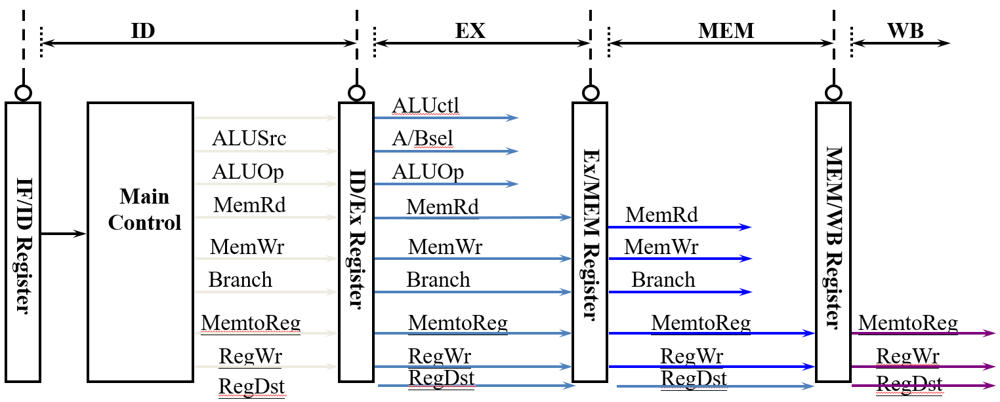

## Hazards

### Structure Hazards

A conflict arising due to hardware resourece limitations within the pipeline.

- Pipeline stalls
- Multiple resources
- Instruction Reordering 
    
    Static scheduling (by compiler) reorders instructions at compile time to avoid hazards, while dynamic scheduling (by hardware) reorders them at runtime based on actual data and resource availability.

- ISA design

Split Instruction/Data caches can **avoid structural hazards in the pipeline** and **increase the cache access bandwidth**.

### Data Hazards

A conflict arising because the current instruction depends on the result of a previous instruction that has not yet been computed or written back.

|Scenario|Data Ready Stage|Data Used Stage|Example|
|:--:|:--:|:--:|:--:|
|Register Access Issues|$\texttt{EX}$|$\texttt{ID}$ <br>It bypasses the ALU, read in ID and held until MEM for memory write.|`add t0, t1, t2`<br> `sw t0, 4(t3)`|
|ALU Result Access Issue|$\texttt{EX}$|$\texttt{EX}$|`add s0, t0, t1` <br> `sub t2, s0, t0`|
|Load Hazard|$\texttt{MEM}$|$\texttt{EX}$|`lw s1, 4(s0)`<br>`add t0, s1, t1`|

#### Solutions

Flow dependence (RAW) is a true data dependence, while anti-dependence (WAR) and output dependence (WAW) are name dependences that can be eliminated by register renaming.

- **Stall pipeline (Interlocking)** 

- **Data Forwarding (Bypassing)** 

    Add forwarding control logic to make extra connections in the datapath.

    Hazard detection compares $\texttt{EX/MEM}$ and $\texttt{MEM/WB}$ destination registers with current instruction’s source registers. (EXE-EXE `EX/MEM.RegRd = ID/EX.RegRs1/2` and MEM-EXE `MEM/WB.RegRd = ID/EX.RegRs1/2`)
    
    Forwarding is skipped when `RegWr == 0` or when the destination register is `x0`.

- **Compiler Code Transformations** 

    Scheduling (reordering) scope is often limited by branches, indirect branches, and call/ret. Memory aliasing (e.g., $p$ and $q$ may point to same address) and unknown latencies (e.g. cache hit/miss unpredictable) further restrict reordering. Compiler must conservatively preserve dependencies.
  
### Control Hazards

Control hazards are due to branch instructions (conditional jumps) and JAL/JALR instructions (unconditional jumps). 

Condition and Target Address are Ready at the $\texttt{EXE}$ Stage.

#### Static Branch Prediction (Compile Time)

- Predict a backward branch as taken (loop back branches) and predict a forward branch as fall-through (the compiler always puts the then part in the fall-through path).
- Conditional branch's (e.g. `blt`) behavior is entirely program‑dependent and cannot be accurately predicted using simple static rules. **Static branch prediction does not read registers at runtime**. It only considers whether the branch target is forward or backward.
- Unconditional branches (e.g. `jal`) always jump, static prediction should always predict **taken**.
- The ISA may reserve a bit in branch instructions as a prediction bit.
- When branch prediction is wrong, **pipeline flushing** is performed.

#### Dynamic Branch Prediction (Run Time)

- **Branch History Table (BHT)** (Branch prediction should occur at the instruction fetch (IF) stage.)

    A branch history table stores past outcomes of branches, indexed by address, to predict future behavior and flush on misprediction.

    Tag identifies which address occupies a cache slot. BHT **omits tags** because prediction bits (1–2) are tiny, tags huge (30–46 bits).

    - **1-bit Predictor** Flips on every misprediction, fails on nested loops.
    - **2-bit Predictor** Four-state FSM, changes only after two consecutive mispredictions, handles loops better.

- **Correlated Predictor**
    
    Global history register selects a 2-bit counter entry in the pattern table. **Current PC** selects which table to use, separating **histories** for different branches.

- **The Location Prediction**
    
    |Branch Type|Prediction Mechanism|Example|
    |:--:|:--:|:--:|
    |Direct branch|Branch Target Buffer (BTB), fixed target|`beq`, `jal`|
    |Indirect branch|Hard to predict|`jalr x0, 4(x1)` (Return branch, Switch statements and Function pointers)|
    |Function return|Return Address Stack (RAS)|`ret`|

# Chapter 5 Optimizing Program Performance

## Compiler Optimization

### Compiler Optimization Levels

| Level | Description |
|:--:|:--:|
| `-O0` | No optimizations, fast compile, for debugging. |
| `-O1` | Basic optimizations. |
| `-O2` | Recommended default: safe, stable, efficient. |
| `-O3` | Aggressive (loop unroll, SIMD). May increase code size, compile time, and even hurt performance. |
| `-O4` | `-O3` + Link-Time Optimization (LTO). |
| `-Os` | Optimize for size, apply for memory-constrained embedded systems. |

### General Goals

#### Minimize the Number of Instructions

- **Common Subexpression Elimination (CSE)** Calculate the same expression once and reuse the result.
- **Dead Code Elimination (DCE)** Don't calculate values that are never used.
- **Strength Reduction (SR)** Avoid slow instructions (multiplication/division).

#### Minimize the Execution Cycles

- **Register Allocation (RA)** Keep frequently used variables in registers.
- **Code Scheduling** Reorder instructions to avoid stalls.
- **Locality Improvement**
- **Preload & Redundant Load Elimination** Load a value once and reuse it, instead of reloading from memory.

#### Avoid Branching

- **Avoid Branching** Conditional move in x86 (`cmov`, e.g. `a = (b > c) ? b : c`), conditional execution in ARM (e.g. `addgt r0, r1, r2`).
- **Loop Unrolling** Reduce the number of branch instructions. Loop unrolling improves performance by reducing the number of branch evaluations and branch mispredictions, also creates opportunities for CSE, code motion, and scheduling.
- **Procedure Inlining** Reduce the overhead of the call. However, inlining can cause register or I‑cache spilling when code grows too large. For recursive functions, inlining may lead to infinite expansion unless the compiler enforces a depth limit.
- **Unswitching** Move a condition outside the loop to avoid branching inside the loop. (e.g. `if (cond) { for (...) { ... } } else { for (...) { ... } }`)

### Limitations

1. Compilers cannot change the algorithm.
2. Compilers must obey the rules and semantics of the programming language.

    - **Memory Aliasing** Two pointers may point to the same memory location. Use a local variable for the intermediate value to avoid redundant loads or use the `restrict` qualifier to promise no aliasing.
    - **FP Associativity** Floating-point addition is not associative.
    - **Function Side Effects** A function may modify global state or have observable effects beyond its return value.
    - **Volatile Variables** A variable declared as `volatile` can be changed by external factors.
    - **Memory Consistency** In multi-threaded programs, compilers must respect memory ordering constraints.
3. Lack of runtime and domain knowledge.
4. Many specific optimization problems are NP-hard.
5. Boundary crossing issues (separate compilation).

### Several Optimization Options

| Flag | Description |
|:--:|:--:|
| `-O3 -flto` | Link-Time Optimization: enables cross-module optimization across file boundaries (e.g., inlining, dead code elimination). |
| `-march=native` | Generate code optimized for the current CPU architecture (enables all supported instruction sets). |
| `-mtune=native` | Optimize instruction scheduling for the current CPU without breaking compatibility with older CPUs. |
| `-fprofile-generate` | Compile instrumented code to generate runtime profiles. |
| `-fprofile-use` | Use profile data to guide optimizations. |
| `-Ofast` | Alias for `-O3 -ffast-math`; allows aggressive FP reordering (may break IEEE compliance). |
| `-fopt-info-missed` | Report which optimizations were missed and why. |

## Memory Locality Enhancements

### Loop Interchange

Loop interchange changes the order of nested loops to improve spatial locality. For example, changing from row-major to column-major access can enhance cache performance.

### Loop Fusion / Fission

Loop fusion combines adjacent loops that iterate over the same range into a single loop, improving temporal locality by accessing data while it is still in cache.

Loop fission (or loop distribution) splits a single loop into multiple loops if the data dependency chain is too long.

### Array Padding

Array padding adds extra space between elements to prevent cache line conflicts.

### Tiling

Tiling for matrix transpose makes the column-wise writes become block-wise contiguous to improve spatial locality. Tiling for matrix multiplication keeps the sub-blocks of A, B, and C in cache simultaneously to maximize data reuse.

### Software Prefetching

Software prefetching inserts instructions to load data into cache before it is actually needed.

<details><summary> Why do we need a separate prefetch 
Instruction? Can we use regular loads? </summary>

Regular loads may cause page faults, read MMIO, or occupy registers. Prefetch instructions are just hints and do not change program semantics.

</details>

<details><summary> Why do we need to specify temporal locality? </summary>

 Temporal locality tells the hardware whether to place data in regular cache (temporal) or streaming buffers (non-temporal) to avoid cache pollution.

</details>

<details><summary> Why do we need to specify prefetch for read/write? </summary>

Read prefetch brings data in shared state, while write prefetch must obtain exclusive ownership in advance.

</details>

### AoS vs. SoA

- **Array of Structures (AoS)** 

Good for memory locality when multiple fields of the same object are accessed together.

```cpp
struct Point { float x, y; } points[N];
for (int i = 0; i < N; i++)
{
    points[i].x += points[i].vx;
    points[i].y += points[i].vy;
}
```

- **Structure of Arrays (SoA)**

Good for cache efficiency when only one field is accessed across many objects.

```cpp
struct Points {float x[N], y[N];} pts;
float sum = 0;
for (int i = 0; i < N; i++) sum += pts.z[i];
```

# Chapter 6 The Memory Hierarchy

## Storage Technologies

Access time is the same for all locations.

All unconventional DRAM chips offer much higher bandwidth, but the latency remains the same (The first data still takes the same time to arrive).

|Feature|SRAM|DRAM|
|:--:|:--:|:--:|
|Transistors per bit|$[4,8]$|$1$|
|Access time|1×|10×|
|Refresh|No|Yes|
|Error Detection and Correction|Optional|Yes|
|Cost|High|Low|
|Main applications|cache memories|**main memory**, frame buffers|

### Static Random Access Memory (SRAM)

### Dynamic Random Access Memory (DRAM)

- **Reading DRAM Supercell** Select row $i$ via RAS, load into buffer. Select column $j$ via CAS, output data, then rewrite row to refresh.
- **Memory Modules** A 64-bit word is stored across eight $8M \times 8$ DRAM chips in parallel, with each chip providing one byte (8 bits) at the same row and column address.

### Memory Wall

The gap between the speed of processors and the main memory. The bottleneck has shifted from how fast memory can respond (latency) to how much data it can deliver per second (bandwidth).

#### Latency

- **Reduction** local memory, NUMA, PIM (Reduce the waiting time for each visit.)
- **Hiding** multi-threading/Hyper-threading, WARP interleaving, chip-multithreading (Keep computation units busy.)

#### Bandwidth

  - **Memory bandwidth** multi-banks and interleaved memory, SDRAM, HBM
  - **Communication bandwith** wider bus, interconnection network

## Locality

### Principle

Many Programs tend to use data and instructions with addresses near or equal to those they have used recently.

### Temporal locality

Recently referenced items are likely to be referenced again in the near future.

### Spatial locality

Items with nearby addresses tend to be referenced close together in time.

<details><summary> What locality is exhibited by the following C loop? </summary>

```c
while (A != NULL) A = A->next;
```

A. Data temporal locality &nbsp; B. Data spatial locality &nbsp; C. Structural locality &nbsp; D. Instruction temporal locality &nbsp; E. Instruction spatial locality

**Answer**

D and E. The loop repeatedly executes the same small set of contiguous instructions (instruction spatial locality) and reuses those instruction addresses across iterations (instruction temporal locality); data locality is absent because each list node is accessed only once and nodes may not be contiguous in memory.

</details>

## Memory Hierarchy

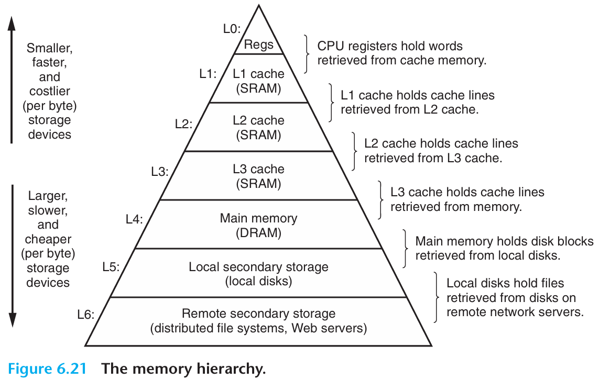

| Level Transfer | Staging Unit | Typical Size | Controlled By |
|:--:|:--:|:--:|:--:|
| Registers ↔ Memory | Instruction Operands | Bits / words (e.g., 32/64 bits) | Compiler (Programmer) |
| Cache / Local Memory ↔ Memory | Blocks / Lines | 64 B (cache line) | Hardware (Cache Controller) / Compiler or Programmer (Local Memory) |
| Memory ↔ Disks | Pages | 4 KB (page) | Hardware & OS (**Virtual Memory**) / Programmer (Files) |
| Disks ↔ Tapes | Files | Variable (e.g., 64 KB–1 MB) | Hardware / Operator or Programmer |

This gives you Large, Cheap memory, but Fast access.

Caches provide automatic (transparent) data movement, while local memory requires explicit programmer-controlled data management.

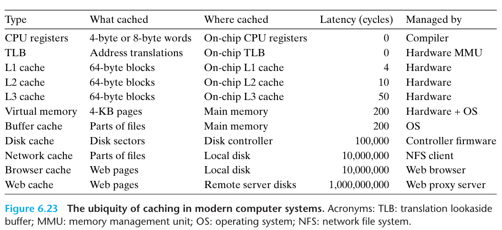

Memory hierarchy is combined with **register and local memory** (managed by software), **cache** (managed by hardware) and **main memory** (managed by hardware and OS) to achieve a balance of speed, size, and cost.

## Cache Management

### General Cache Memory Organization

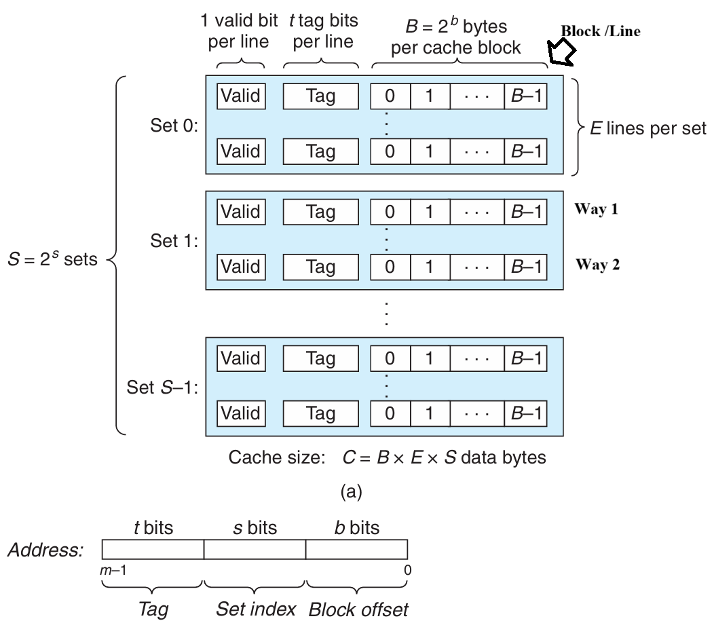

### Direct Mapped Caches

- **Valid Bit**

    A cache line is invalid (valid bit equals to $0$) when:

    - When a cache line of data has not come back from memory yet
    - Cache line is currently being replaced
    - Cache is flushed

- **Three Steps**

    - **Set Selection** Use the set index as an unsigned binary number to locate the cache set.
    - **Line Matching** Compare the tag to determine if the desired block is present in the set.
    - **Word Extraction** Use the block offset as a binary number to select the appropriate word within the cache line.

<details><summary>Why is the set index typically taken from the middle bits of the address rather than the high bits?</summary>

Using high bits as the set index causes consecutive memory blocks to map to the same set, leading to more conflict misses, whereas middle bits distribute blocks across sets to better exploit spatial locality.

</details>

### Set Associative Caches

$N$-way set-associative has $N$ lines per set while direct-mapped is one way and fully associative is one set.

Given a cache with total size $C$ measured in kilobytes, associativity $E$, and block (line) size $B$ measured in bytes. The number of sets $S$ is calculated as $S = \frac{1024C}{BE}$.

- TLB and victim cache are typically fully associative to maximize hit rate with small size.

### Performance Impact of Cache Parameters

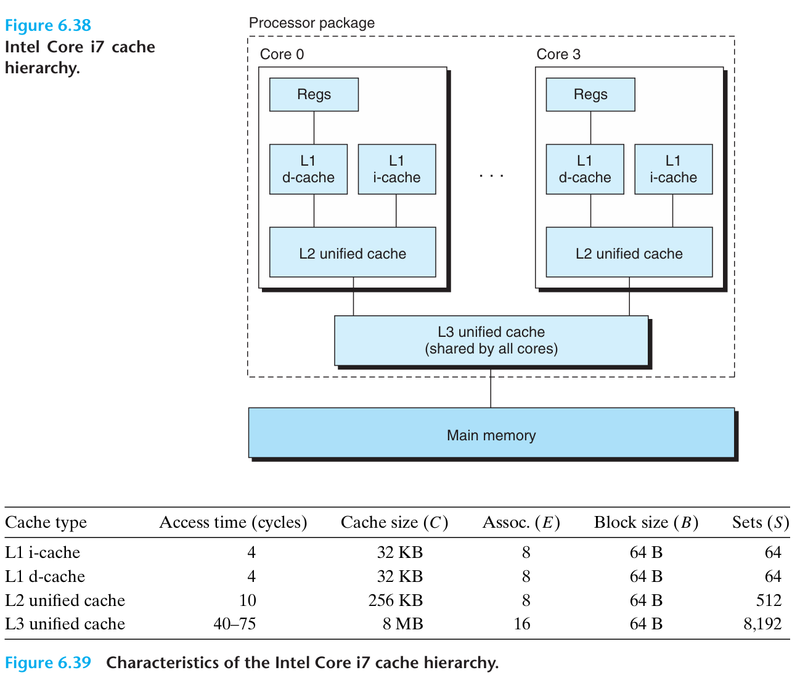

| Feature | L1 Cache | L2 Cache |
|:--:|:--:|:--:|
| **Primary goal** | Minimize hit time | Minimize miss rate  |
| **Locality preference** | Spatial locality | Temporal locality |
| **Typical write policy** | Write-through to L2 (one option) | Write-back (more common) |
| **Reason** | L1 hit directly affects pipeline performance | L2 miss leads to high memory penalty, bus traffic, and latency |
| **Size** | Small | Large |

- When the block size is too small, the cache cannot fetch enough contiguous data in a single miss (lower spatial locality -- most accesses to nearby addresses still result in cache misses).
- When the block size is too large, the fixed-size cache holds fewer blocks, leading to more conflicts, frequent replacements and higher miss penalty (lower temporal locality -- the recently used data is quickly evicted before it can be reused).
- Number of cache lines is determined by the cache size and the line size.

| Parameter / Change | Block Offset Bits | Set Index Bits | Tag Bits |
|:---|:---:|:---:|:---:|
| Formula (64‑bit address) | $\log_2 B$ | $\log_2 S$ | $64 - \log_2 B - \log_2 S$ |
| Increase block size $B$ | $\uparrow$ | $\downarrow$ | — |
| Increase cache size $C$ | — | $\uparrow$ | $\downarrow$ |
| Increase associativity $E$ | — | $\downarrow$ | $\uparrow$ |

### Cache Hit and Miss

#### Cache Read

- **Read Hit**

- **Read Miss** When a read miss occurs, the CPU stalls the pipeline, fetches the missing block from the next memory level, and then resumes execution.

#### Cache Write

- **Write Hit**

    - **Write Through** 

        It simultaneously updated to cache and memory. It ensures data isn't lost if the cache is disrupted, but increases memory traffic and write latency. 
        
        Solution:  **write buffer**. A write buffer hides write latency, but if store frequency exceeds the DRAM write cycle, the buffer saturates and stalls the CPU (Write buffer allows write-coalescing/combining to reduce traffic to memory.).
    
    - **Write Back** 
        
        The CPU writes data only to the cache initially, and main memory is not updated until the cache line is eventually replaced (need Dirty Bit). This reduces memory traffic and write latency, but creates cache-memory inconsistency, requiring cache coherence protocols (e.g., MESI) in multi-core systems. Data loss risk on cache failure is mitigated by Error Correcting Code (ECC) protection.

- **Write Miss**
    - **Write Allocate** First read the data from main memory and loaded into the cache, and then the write operation is performed on the cached copy.
    - **No Write Allocate** It writes the data directly to main memory without loading the missing block into the cache (Better for streaming writes, e.g. writing database logs).

| Aspect | Write Through + No Write Allocate | Write Back + Write Allocate |
|:--:|:--:|:--:|
| **Write Miss Behavior** | Bypass cache, write directly to main memory (optionally via write buffer + write-combining) | Load missing block from main memory into cache first, then write to cache |
| **Typical Partner** | Write Through Cache | Copy Back (Write Back) Cache |
| **Initial Cost** | Low (no main memory read) | High (one read miss) |
| **Reuse Cost** | High (data not in cache, still miss on reuse) | Low (subsequent reads/writes hit in cache, only set dirty bit) |
| **Best For** | Write once, never reused data (e.g., writing logs) | Repeated reads/writes to same data (temporal locality) |

#### Instruction Cache Miss Handling

On an instruction cache miss, the CPU sends the PC to memory, waits for the read to complete, writes the fetched data into cache with its tag and valid bit set, then restarts the instruction fetch. (Instruction cache prefetching is a commonly used hardware optimization to reduce instruction cache misses.)

<details><summary> Can you prefetch for instruction cache in software? </summary>

Software cannot directly prefetch instructions (the fetch stage is PC-driven), unlike data prefetching. It can only indirectly affect I-cache hit rate via code layout or execution order.

</details>

<details><summary> If we prefetch on every miss, why not just use a larger cache line size? </summary>

- **Branch-sensitive** Prefetching follows the predicted path, fetching only useful instructions. Large lines load all adjacent instructions regardless of branches, wasting bandwidth and cache space on dead code.
- **False sharing** Large lines reduce effective cache capacity, more likely to cause conflict.
- **Bandwidth-aware** Large line increases the cost of every miss. Prefetch is more flexible.

</details>

<details><summary> Why does the GPU prefetch for the next 10-12 lines, but the CPU only prefetches for 1-2 lines?  </summary>

GPU prefetches 10–12 lines because it is throughput‑oriented with highly linear instruction flow, making deep prefetch safe, while CPU, being latency‑sensitive with frequent branches, only prefetches 1–2 lines to avoid polluting the cache and wasting bandwidth on wrong paths.

</details>

#### Types of Cache Misses

- **Compulsory (or Cold) Miss** The first access to a block that has never been loaded into the cache before. (Hardware prefetching & larger cache **line** size to reduce compulsory misses.)
- **Conflict (or Collision) Miss** Multiple references are mapping to the same set, and the set is not large enough to hold them. 
- **Capacity Miss** Cache is not large enough to hold needed blocks.
- **Coherence Miss** Caused by invalidation from other processors in a multiprocessor system to maintain cache coherence.

#### Ways to Reduce Cache Miss Penalty

| Technique | Core Idea | How It Hides Penalty |
|-----------|-----------|----------------------|
| Critical Word First and Early Restart | Fetch requested word first; resume execution immediately | Reduces wait time; overlaps load with execution |
| Non-Blocking Cache | Continue on miss; track multiple misses with MSHRs | Overlaps multiple misses |
| Cache Prefetching | Fetch data before it is needed | Avoids miss entirely |
| Write Buffer | Hold dirty blocks temporarily; write back later | CPU doesn't wait for write |
| Cache-Aware Code Scheduling | Compiler reorders instructions | Overlaps miss with computation |

### Non-Blocking Cache and Blocking Cache

#### Blocking Cache

A cache miss stalls the CPU pipeline immediately (stall on miss).

#### Non-Blocking Cache (Lockup-Free Cache)

The CPU continues executing other instructions on a miss and stalls only when the data is needed, using **Miss Status Holding Register** (MSHRs) to track outstanding misses (stall on use). Non-blocking caches support MLP (Memory Level Parallelism).

- **Hit under Miss** During one miss, the cache can still handle subsequent hits.
- **Miss under Miss (better)** During one miss, the cache can also handle another miss, allowing multiple outstanding misses. 

### Cache Block Replacement

#### Direct Mapped

Each set has only one line, so the new block always replaces the existing block in that set.

#### Set ssociative or Fully Associative

- **Random**

- **Least Recently Used (LRU)** [stack algorithm]
  
    Hardware keeps track of the access history and replaces the block that has not been used for the longest time.

    Each block has a counter. On a hit, reset its counter to 0 and increment all other counters in the set. On a miss, replace the block with the highest counter value.


- **First In First Out (FIFO)** The block that has been in the cache the longest is replaced, regardless of access history.

- **Belady’s Algorithm** [upper bound]

    Replace the block that will not be used for the longest time in the future. It is optimal but requires perfect knowledge of future accesses, making it impractical for real hardware.

### Victim Cache

A small fully associative cache placed between the main cache and memory to hold recently evicted blocks, reducing conflict misses by providing a second chance for recently replaced data. Since such conflicts occur in only a few sets, just 4–8 entries suffice for fast access, combining the speed of direct-mapped L1 with the benefit of full associativity.

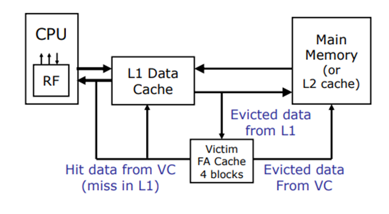

### Snoopy Cache Coherence Schemes

Snoopy cache maintains coherence in bus-connected multi-processors by broadcasting all coherence operations over a shared bus. Every cache controller snoops the bus and reacts based on its local cache state. Each controller is a bidirectional state machine that processes CPU requests and bus snoop events, updating states according to a transition diagram.

Multiple controllers form a distributed algorithm operating at cache block granularity. The MESI protocol, with its four states (Modified, Exclusive, Shared, Invalid), tracks each block to enable coherence while minimizing bus traffic and memory accesses.

### Exclusive/Inclusive Caches

Inclusive L2 caches simplify coherence invalidation in multiprocessor systems by checking at the L2 level, despite wasting capacity, which modern processors tolerate for easier consistency management, making inclusive more common than exclusive today.

#### Inclusive caches 

Every line in L1 must be presented in L2 ($\text{L1} \subseteq \text{L2}$). When L2 evicts a line, it must invalidate the corresponding line in L1, and L2 can have a larger line size than L1.

#### Exclusive caches 

if a line A is in L1, it must not be present in L2. AMD adopted this policy for its L2/L3 hierarchy. When L1 evicts a line, it moves to L2. On an L1 miss that hits in L2, the line migrates from L2 to L1. L1 and L2 must also have the same line size.

#### NINE (Non-Inclusive and Non-Exclusive)  

More suitable for L2/L3.

### Average Memory Access Time (AMAT)

Usually, `%instr` is higher than `%data`, but I-cache hits better because instruction accesses are highly sequential with strong spatial locality, have no write misses (read-only), and exhibit simpler access patterns than data references, which often involve random pointers or strided array accesses.

AMAT was accurate for blocking caches and in-order CPUs, but lost relevance as out-of-order execution, non-blocking caches, prefetching hid miss latency and spliting I/D caches.

#### Low Hit Latency

- **Small and Simple**
- **Direct-map or low associativity** Number of comparators needed equals total cache entries for fully associative, but only $n$ for $n$-way set associative.
- **Prediction** Predict which way to compare first.
- **Virtual address cache or virtual index and physical tagged cache** Avoid or overlap with address translation delay.
- **Cache layout closer to CPU to minimize signal delay**

# Chapter 7 Linking

## Why Linking Matters

### Modularity

Separate compilation allows developers to work on different modules independently, improving productivity and enabling code reuse.

### Efficiency

- **Time** Separate compilation & Parallel compilation.
- **Space** Static linking (Executable files and running memory images contain only the library code they actually use.) & Dynamic linking (Executable files contain no library code. During execution, a single copy of the library code is shared among all executing processes.)

## Static Linking

### Symbol Resolution

Symbol tables in object files record symbol definitions (name, size, location), and the linker matches each symbol reference to exactly one definition during symbol resolution.

#### Link Symbols

| Type | Description | Example |
|:--:|:--:|:--:|
| **Global symbols** | Defined by module m, can be referenced by other modules. | `int global_var = 10;`<br>`void func() { }` |
| **External symbols** | Referenced by module m but defined by some other module. | `extern int global_var;`<br>`extern void func();` |
| **Local symbols** | Defined and referenced exclusively by module m. | `static int local_var = 10;`<br>`static void helper() { }` |

Strong symbols are procedures and initialized globals, while weak symbols are uninitialized globals. Linker's Symbol Rules: Multiple strong symbols are forbidden; one strong wins over weak; multiple weak are arbitrary, unless `-fno-common` forces an error.

<details><summary> Example </summary>

- `file1.c`

    ```c
    int x = 10; // strong symbol   
    int y = 5;  // strong symbol
    void p1() {printf("x = %d, y = %d\n", x, y);}
    ```

- `file2.c`

    ```c
    double x; // weak symbol
    void p2() {printf("x = %f\n", x);}
    ``` 

Writes to $x$ in `p2` might overwrite $y$.

</details>

Avoid **global symbols** if possible, otherwise use `static` to limit scope, initialize globals to make them strong, and reference external globals with `extern` to avoid linker errors.

#### Static Libraries

Concatenate related relocatable object files into a single file with an index (called an **archive**). For example, `ar rs libfoo.a a.o b.o c.o` creates a static library `libfoo.a` containing `a.o`, `b.o` and `c.o`. 

Linkers scan files left to right, maintain an unresolved reference list, and only extract archive members that resolve current entries, so libraries must come at the end of the command line.

The solution to deal with the order sensitivity and duplicate symbol definitions is to introduce Shared libraries are object files whose code and data are loaded and linked into an application dynamically, either at load time or at run time.

### Relocation

It first merges all separate code and data sections into single sections. Then, it relocates symbols from their relative offsets in `.o` files to final absolute addresses in the executable. Finally, it updates every reference to these symbols to reflect their new positions.

## Object Files

### Classification

| Type | Extension (Linux/Unix) | Description |
|:--:|:--:|:--:|
| **Relocatable Object File** | `.o` | Contains code and data in a form that can be combined with other relocatable object files to form an executable object file. Each `.o` file is produced from exactly one source (`.c`) file. |
| **Executable Object File** | `a.out`| Contains code and data in a form that can be copied directly into memory and then executed. |
| **Shared Object File** | `.so` |Special type of relocatable object file that can be loaded into memory and linked dynamically, at either load time or run-time. It also called Dynamic Link Libraries (DLLs) by Windows. |

### ELF Object File Format

<div style="display: flex; align-items: center; gap: 20px;">
  <div style="flex: 1;">

| Component | Description |
|-----------|-------------|
| **ELF Header** | Word size, byte ordering, file type (`.o` / executable / `.so`), machine type, etc. |
| **Segment Header Table** (for OS) | Page size, virtual address memory segments (sections), segment sizes. |
| **.text** | Code |
| **.rodata** | Read-only data: jump tables, string constants, etc. |
| **.data** | Initialized **global variables** and **initialized local static variables**. |
| **.bss** | Uninitialized **global variables** and **uninitialized local static variables**. <br> Has section header but occupies no space. |
| **.symtab** | Symbol table: **procedure names**, **global variable names**, **static variable names**, **external symbols** (with `UND`), section names, and their locations. |
| **.rel.text** | Relocation info for `.text` section: addresses of **instructions** that will need to be modified in the executable, plus instructions for modifying. |
| **.rel.data** | Relocation info for `.data` section: addresses of **pointer** data that will need to be modified in the merged executable. |
| **.debug** | Info for symbolic debugging (generated with `gcc -g`). |
| **Section Header Table** (for execution and debugging) | Offsets and sizes of each section. |

  </div>
  <div style="flex: 1; display: flex; justify-content: center;">
    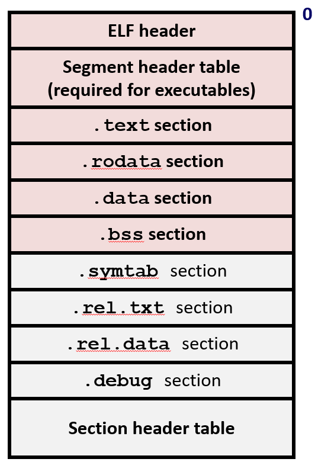
  </div>
</div>

- Using the command `readelf -s <file>` to view the symbol table of an 
**Executable and Linkable Format** (ELF) file.

- Note that Local non-static variables are stored on the stack.

- It will create local symbols in the symbol table with unique names.


## Executable Object Files

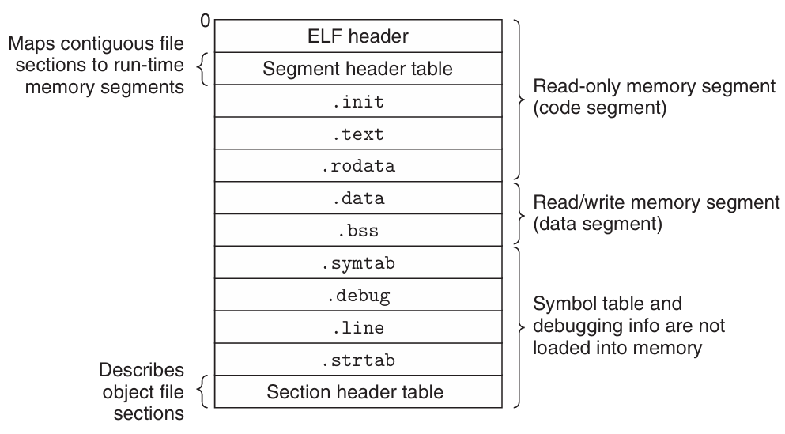

## Load Executable Object Files

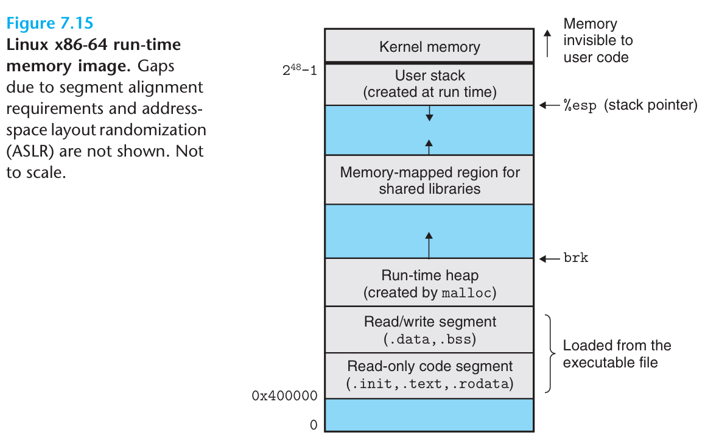

## Dynamic Linking with Shared Libraries

### Load-Time Linking

It occurs when the executable is first loaded and run. The standard C library (`libc.so`) is typically dynamically linked this way.

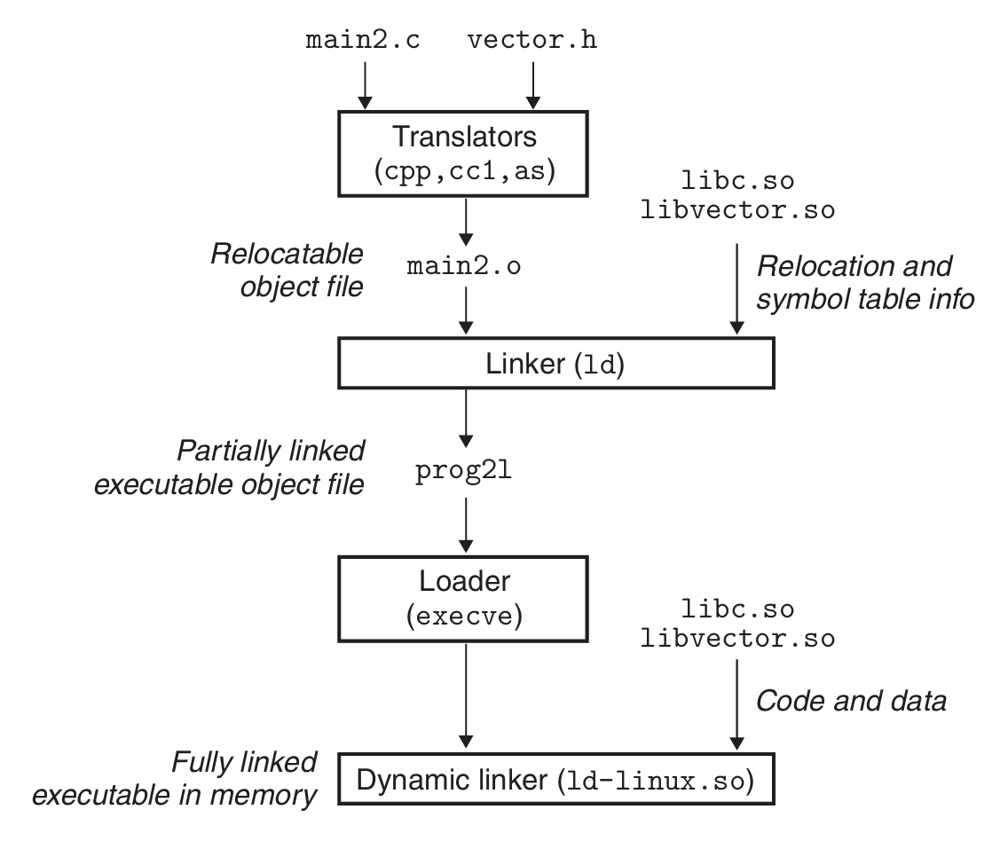

`LD_PRELOAD` forces the dynamic linker to load a user-specified shared library first, allowing interception of standard functions, but cannot intercept statically linked `_start`.

### Run-Time Linking

It occurs after the program has begun, using calls to the `dlopen()` interface on Linux.

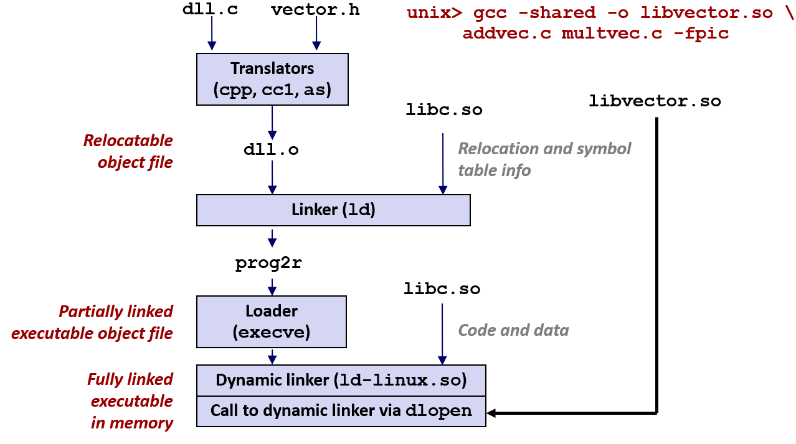

## Position-Independent Code (PIC)

To exploit the fact that the distance between any instruction in the code segment and any variable in the data segment is a runtime constant, the compiler creates a table called the Global Offset Table (GOT) that holds the absolute addresses of global variables.

### Global Offset Table (GOT) 

Residing in the `.data` segment, the GOT stores the actual absolute addresses of external functions and global variables. These addresses are filled in by the dynamic linker either at load time or upon the first function call, after which the GOT typically becomes read-only to prevent tampering. 

It consists of two parts: the `.got` section holds addresses of global variables for direct access, while the `.got.plt` section stores external function addresses specifically used by the PLT stubs.

### Procedure Linkage Table (PLT)

The PLT is located in the read-only `.text` segment. It contains small executable code stubs for each external function the program calls. Instead of calling an external function directly, the program calls its PLT stub, which acts as a trampoline that safely jumps through the `.got.plt` (in the `.data` segment) to reach the actual function address.

### Whole Process

| Step | Stage| Action |
|:--:|:--:|:--:|
| 1 | Compile (static time) | Compiler generates pseudo instruction: call printf |
| 2 | Compile (static time) | Assembler expands to `auipc+jalr`, adds reloc entries|
| 3 | Link (walk time) | Linker creates .plt stub (`auipc+ld+jalr`)|
| 4 | Link (walk time) | Linker allocates GOT entry (44B for 32b, 8B for 64b) |
| 5 | Dynamic Linking (run time) | Dynamic linker fills GOT with real printf address |

## Comparsion

| Tool | Input | Output | Key Responsibility | Timing |
|:---|:---|:---|:---|:---|
| **Assembler** | Assembly code (.s) | Relocatable object file (.o) | Translate assembly → machine code; Generate relocation entries (.rel.text, .rel.data) | **Compile-time** |
| **Linker** (Static) | Multiple .o files + Static libs (.a) | Executable file (ELF) / Shared lib (.so) | Symbol resolution; Section merging; Relocation (static) | **Compile-time / Link-time** |
| **Loader** | Executable file (ELF) | Process image in memory | Copy executable → RAM; Allocate stack/heap; Transfer control | **Program startup** |
| **Dynamic Linker** | Shared libraries (.so) + GOT/PLT | Resolved function addresses (in GOT) | Load shared libs; Perform runtime relocation; Support lazy binding | **Program startup / First call** |