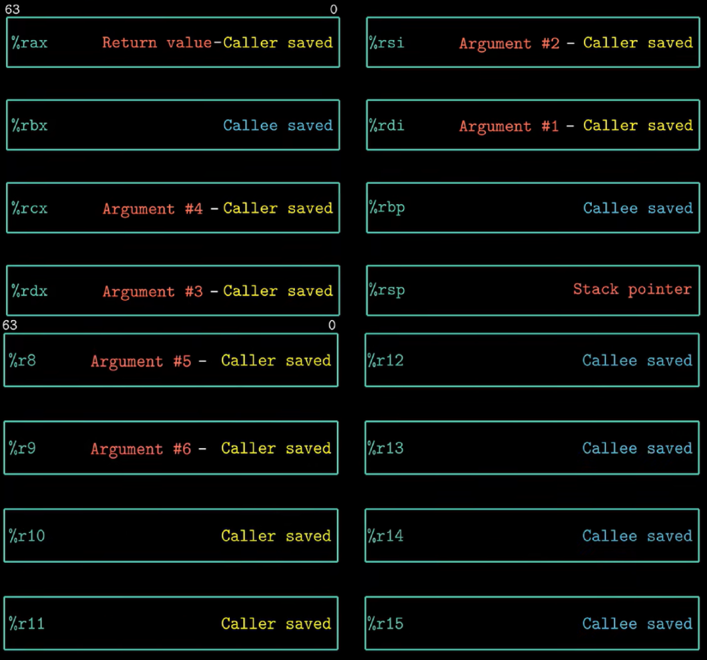
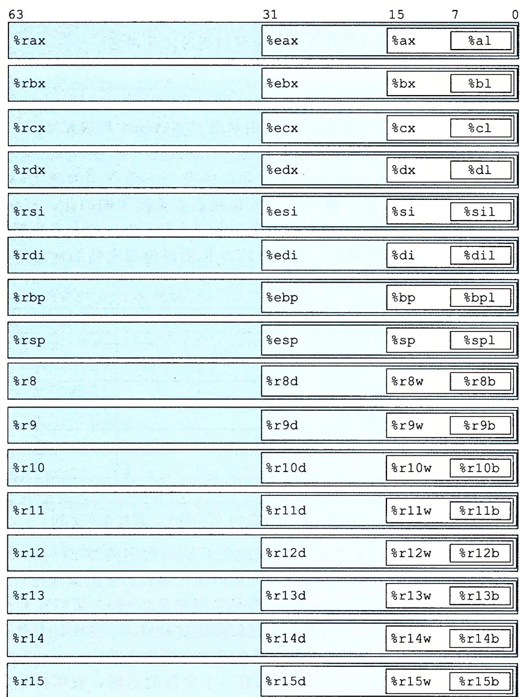
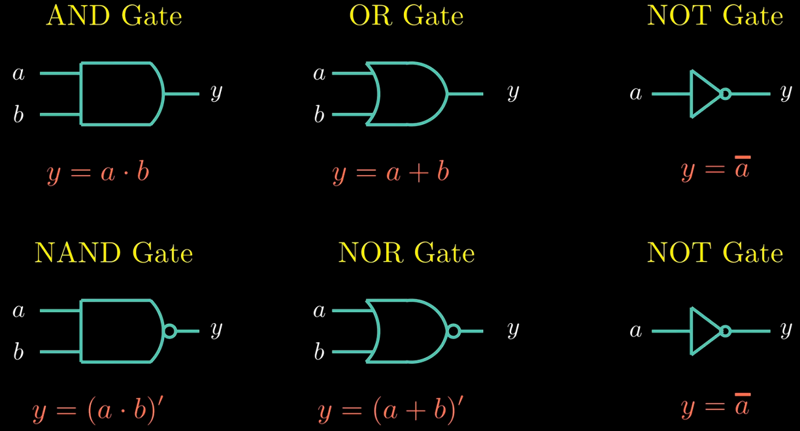
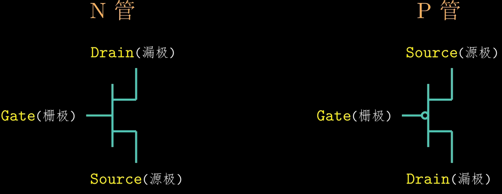
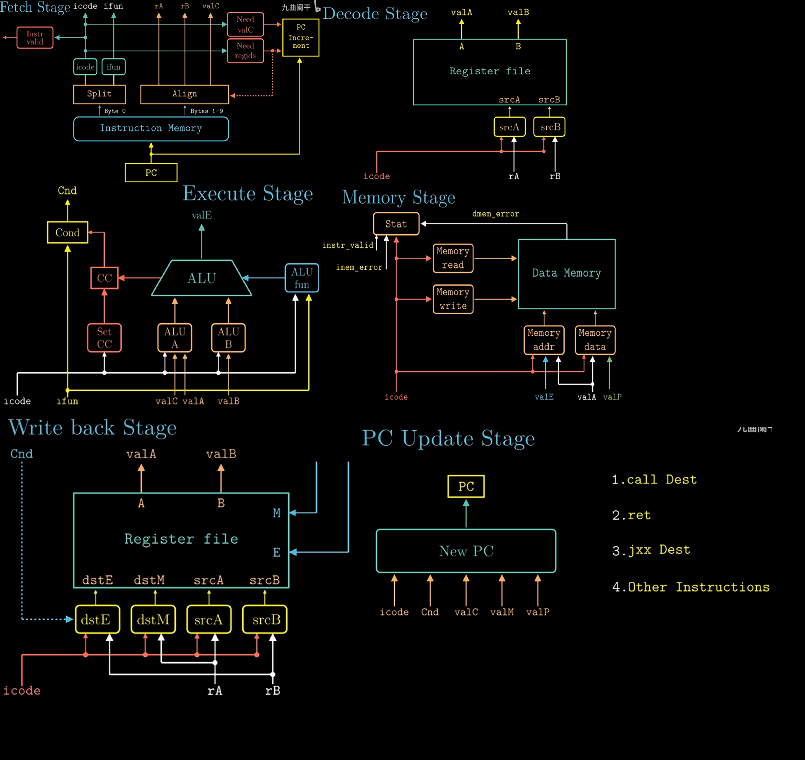
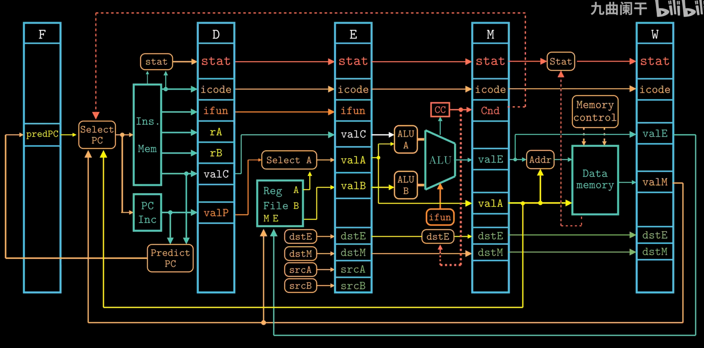
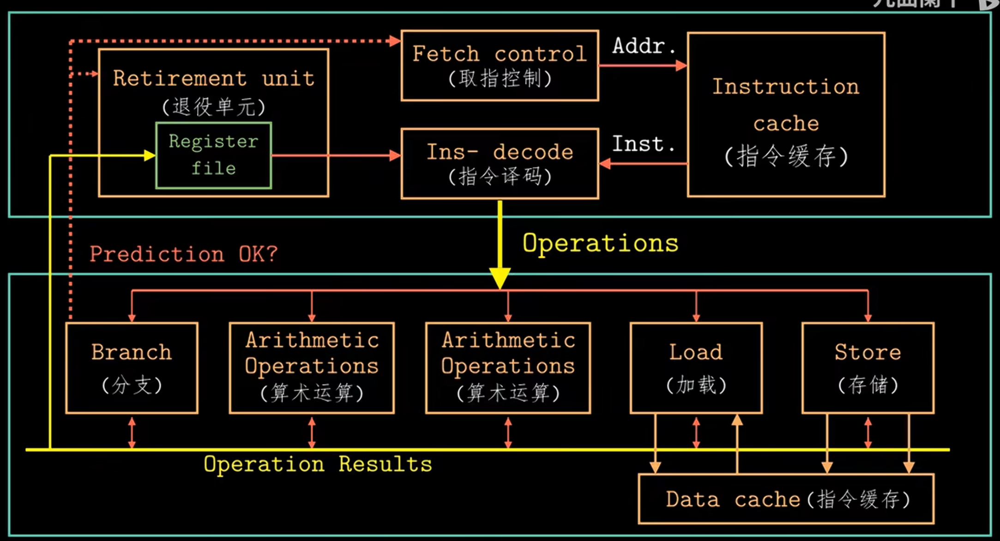

# Chapter 1 A Tour of Computer System

### Compilation System
    
Take C language as an example `linux > gcc hello.c -o hello`.

- **Pre-processor** (cpp)   

    $\texttt{.c} \to \texttt{.i}$ Handles include/define, strips off comments and conditional compilation #ifdef

- **Compiler** (cc1)   

    $\texttt{.i} \to \texttt{.s}$ Scan/parse/semantic check/code gen/opt

- **Assembler** (as)   

    $\texttt{.s} \to \texttt{.o}$ From assembly to machine code

- **Linker** (ld) $\texttt{.o} \to \texttt{Executable}$ 

    Relocation & reference resolution [重定位 & 引用解析]

### Hardware Organization of a System


DMA (Direct Memory Access) is usually used for high-spped and bulk data transfers, controlled by system programmers.

- **System Bus** 

    Transfer data in fixed-size blocks called words (4/8 bytes on a 32/64 bit system)

### Memory Hierarchy


The localities of cache: **Temporal Locality** & **Spatial Locality**.

### Abstractions in Computer Systems (Virtualization)


Virtualization is often related to multiplicity, fake versions, and sharing.

- **Process & Thread**

    Multiple processes can run concurrently on the same system, and each process appears to have exclusive use of the hardware. 
    
    Context switching with OS Kernel.

    A process can actually consist of multiple execution units, called threads. Threads shares the same code and global data.

- **Virtual Memory**

    Program Code & Data, Shared Libraries, Heap, Stack, Kernel Virtual Memory from bottom to top.
    
    - Virtual address space canve greater than the  physical memory.

    - Memory serves as a cache for virtaul memory.

    - Support multiprogramming.

    - Allow multiple processes to share data.

- **File**

### Import Themes

#### Amdahl's Law (Quantifying the performance improvement ceiling)

$T_{new} = (1 - \alpha) T_{old} + \frac{\alpha T_{old}}{k} = T_{old} (1 - \alpha + \frac{\alpha}{k})$

$S = \frac{T_{old}}{T_{new}} = \frac{1}{1 - \alpha + \frac{\alpha}{k}}$

#### Concurrency and Parallelism

- **Concurrency** It refers to the general concept of a system having multiple, simultaneous activities, which do not necessarily execute at the same time, but may interleave in time to create the logical impression of simultaneity.

- **Parallelism** It refers to the use of concureency to make a system run faster.

#### ILP and DLP

- **Instruction-Level** e.g. Parallelism pipelining, superscalar, out-of-order execution.

- **Data-Level Parallelism** e.g. Single Insruction Multiple Data (SIMD), Vector instructions.

# Chapter 2 Representing and Manipulating Information

## Information Storage

- **Words**

    $w$ word size $\Longleftrightarrow$ $[0,2^w)$ virtual address space

- **Addressing and Byte Ordering** Big endian & Little endian

- **ABI**  Application Binary Interface

    It is based on three key components : the computer ISA, the OS, and the calling convention. ABI incompatibility will occur due to differences between operating systems.

## Integer Representaions

### Sizes of Data Type in C/C++

|Signed|Unsigned|32-bit (Bytes)|64-bit (Bytes)|
|:--:|:--:|:--:|:--:|
|$\texttt{[signed] char}$|$\texttt{unsigned char}$|1|1|
|$\texttt{short}$|$\texttt{unsigned short}$|2|2|
|$\texttt{int}$|$\texttt{unsigned}$|4|4|
|$\texttt{long}$|$\texttt{unsigned long}$|$\color{red}\textbf{4}$|$\color{red}\textbf{8}$|
|$\texttt{int32{\_}t}$|$\texttt{uint32{\_}t}$|4|4|
|$\texttt{int64{\_}t}$|$\texttt{uint64{\_}t}$|8|8|
|$\texttt{char *}$|—|$\color{red}\textbf{4}$|$\color{red}\textbf{8}$|
|$\texttt{float}$|—|4|4|
|$\texttt{double}$|—|8|8|

### Unsigned Encodings

Suppose a vector $\mathrm{x} = [x_{w - 1},x_{w - 2},\cdots,x_0]$, then $\operatorname{B2U_w}(x) = \sum \limits_{i = 0}^{w - 1}x_i \cdot 2^i$

### Two's Complement Encodings

><strong>Inverse form (1's Complement)</strong> For a negative number, keep the signed the same and invert the rest.<br> two zero exits & end-round carry out issues (hte end carry-out bit needs to add back to the LSB)
<br><br>
<strong>2's Complement</strong> For a negative number, keep the sign the same, invert the rest and add 1.

Suppose a vector $\mathrm{x} = [x_{w - 1},x_{w - 2},\cdots,x_0]$, then $\operatorname{B2T_w}(x) = -x_{w - 1} \cdot 2^{w - 1} + \sum \limits_{i = 0}^{w - 2}x_i \cdot 2^i$

### Conversions between Signed and Unsigned

$$
\operatorname{T2U_w}(x) = 
\begin{cases}
x + 2^w,\quad x < 0 \\
x,\quad x \ge 0
\end{cases}
\quad
\operatorname{U2T_w}(u) = 
\begin{cases}
u,\quad x \le Tmax_w\\
u - w^w,\quad x > Tmax_w
\end{cases}
$$

For a $n$-bit 2's complemetn signed binary numeral system:

- Minimum $-2^{n - 1}$, corresponding to binary $\texttt{100} \cdots \texttt{0}$ (A special case that does not satisfy the **invert bits and add 1** rule used for other negative numbers).
- Maximum $2^{n - 1} - 1$, corresponding to binary $\texttt{011} \cdots \texttt{1}$.

### Sign Extension

#### Small to Big

- Zero extension of unsigned numbers

- Sign extension of two's complement numbers

    $\operatorname{B2T_w}([x_{w - 1},x_{w - 2},\cdots,w_0]) = \operatorname{B2T_{w + k}}([x_{w - 1},x_{w - 1},\cdots,x_{w - 1},x_{w - 1},x_{w - 2},\cdots,x_0])$

    Since $\operatorname{B2T_{w + 1}} -\operatorname{B2T_w} = (-x_{w - 1} \cdot 2^w + x_{w - 1} \cdot 2^{w - 1}) - x_{w - 1} \cdot 2^{w - 1} = 0$, by induction, we can proof it.

#### Big to Small

- $\operatorname{B2U_{k}}(x) = \operatorname{B2U_{w}}(x) \bmod 2^k$

- $\operatorname{B2T_{k}}(x) = \operatorname{U2T_{w}}(\operatorname{B2U_{w}}(x) \bmod 2^k)$

## Integer Arithmetic

### Addition

$$
x + y^u_w = 
\begin{cases}
x + y,\quad x + y < 2^w \\
x + y - 2^w,\quad 2^w \le x + y < 2^{w + 1}
\end{cases}
$$

$$
x + y^t_w = 
\begin{cases}
x + y - 2^w,\quad 2^{w - 1} \le x + y\\
x + y,\quad -2^{w - 1} \le x + y < 2^{w - 1} \\
x + y + 2^w,\quad x + y < -2^{w - 1}
\end{cases}
$$

### Additive Inverse

$x + x' = 0\ \text{or}\ 2^w$

$$
-x^u_w = 
\begin{cases}
x,\quad x = 0 \\
2^w - x,\quad x > 0
\end{cases}
\quad
-x^t_w = 
\begin{cases}
x,\quad x > Tmin_w \\
Tmin_w,\quad x = Tmin_w
\end{cases}
$$

- For two numbers A, B, the overflow occurs when `(NOT (sign_A XOR sign_B)) AND (sign_A XOR new_sign) == 1`. (Two operands have the same sign but the result has a different sign.)

- One Bit Full Adder 

    $S_i = A_i + B_i + \text{carry\_in} \quad \text{carry\_out} = (A_i \& B_i) | (\text{carry\_in} \& (A_i \oplus B_i))$

- Carry Lookahead Adder 
    
    $$
    \begin{cases}
    g_i = (A_i \cdot B_i) \\
    p_i = (A_i \oplus B_i) \\
    C_1 = g_0 + (p_0 \cdot C_0) \\
    C_2 = g_1 + (p_1 \cdot g_0) + (p_1 \cdot p_0 \cdot C_0) \\
    C_3 = g_2 + (p_2 \cdot g_1) + (p_2 \cdot p_1 \cdot g_0) + (p_2 \cdot p_1 \cdot p_0 \cdot C_0) \\
    \vdots
    \end{cases}
    $$

    

### Multipilication

$$
x \times y^u_w = (x \cdot y) \bmod 2^k \\
x \times y^t_w = \operatorname{U2T_w}((x \cdot y) \bmod 2^k)
$$

### Division (by a power of 2)

Unsigned numbers use **logical shift**, while two's complement numbers use **arithmetic shift** to achieve sign-preserving extension.

Right shift performs integer division by powers of two : 

- $x \le 0 \quad x >> k = \lfloor \frac{x}{2^k} \rfloor$

- $x < 0 \quad (x + (1 << k) - 1) >> k = \lceil \frac{x}{2^k} \rceil$

## Floating Point

### Floating-Point Representation

$V = (-1)^s \times M \times 2^E$

s (sign) : The number is positive ($s=0$) or negative ($s=1$).

M (fraction) : A binary fraction.

E (exponent) : $2^E$ weight.

$\texttt{bias (float)} = 127 \quad \texttt{bias(double)} = 1023$ ($\texttt{bias} = 2^{k - 1} - 1$)

|Category|Exponent $e$|Fraction $f$|Value Formula|
|:--:|:--:|:--:|:--:|
|Normalized|$1 \le e \le 254$|any|$V = (-1)^s \times (f{\color{red} + 1}) \times 2^{\color{red}{e - 127}}$|
|Denormalized|$e = 0$|$f \neq 0$|$V = (-1)^s \times f \times 2^{\color{red}{-126}}$|
|Zero|$e = 0$|$f = 0$|$V = \pm 0.0$|
|Infinity|$e = 255$|$f = 0$|$V = \pm \infty$|
|NaN (Not a Number) |$e = 255$|$f \neq 0$|`NaN`|

#### Comparison (postive number)

|Format|Minimum|Maximum|
|:--:|:--:|:--:|
|Single Precision Normalized <br> $V = (-1)^s \times \overline{1.f} \times 2^{e - 127}$|$e = \texttt{00000001}$ <br> $E_{\min} = -126$ <br> $f = 0$ <br> $V = 1.0 \times 2^{-126}$|$e = \texttt{11111110}$ <br> $E_{\max} = 127$ <br> $f = 0.\underbrace{11\ldots 1}_{23\ \text{ones}}$ <br> $M = 1 + f = 1 + (1 - 2^{-23})$ <br>$V = 1.0 \times 2^{127} \times (2 - 2^{-23}) \approx 3.4 \times 10^{38}(\texttt{0x7F7FFFFF})$|
|Single Precision Denormalized <br> $V = (-1)^s \times \overline{0.f} \times 2^{-126}$|$e = \texttt{00000000}$ <br> $f = 2^{-23}$ <br> $V = 1.0 \times 2^{-149}(\texttt{0x00800000})$|$e = \texttt{00000000}$ <br> $f = 0.\underbrace{11\ldots 1}_{23\ \text{ones}}$ <br> $V = 1.0 \times 2^{-126} \times (1 - 2^{-23})$|

#### Rounding

|Round-down|Round-up|Round-toward-zero|Round-to-even|
|:--:|:--:|:--:|:--:|
|$1.40 \to 1$<br>$-1.5 \to -2$|$1.40 \to 2$<br>$-1.5 \to -1$|$1.40 \to 1$<br>$-1.5 \to -1$|$1.40 \to 1$<br>$1.6 \to 2$<br>$1.5 \to 2$<br>$2.5 \to 2$<br>**Non-midpoint** round to the nearest representable value<br>**Midpoint** choose the $\color{red}\textbf{even}$ one|

#### Floating Point Operations

Lack of Associativity & Lack of Distributivity

<details><summary>Example Questions</summary>

Let $x,f,d$ are of type `int`, `float`, `double` (Their values are arbitrary, except that neither $f$ nor $d$ equals $+\infty$, $-\infty$, or $\texttt{NaN}$.). Then:

- `x == (int)(double) x` True
- `x == (int)(float) x` False $2^{24} - 1 \to (1 + 0.\underbrace{11\ldots 1}_{23\ \text{ones}}) \times 2^{23}$ (e.g. $16777217$)
- `d == (double)(float) d` False (e.g. $1.234$)
- `f == (float)(double) f` True
- `d*d >= 0.0` True

</details>

#### Precision (IEEE 754-2008 Standard Formats)

| Format | Sign Bits | Exponent Bits | Mantissa Bits |
|--------|-----------|---------------|---------------|
| Quad precision | 1 | 15 | 112 |
| Double precision | 1 | 11 | 52 |
| Single precision (FP32) | 1 | 8 | 23 |
| Half precision (FP16) | 1 | 5 | 10 |

<details><summary>bfloat16</summary>

- Format: 1 sign, 8 exponent, 7 mantissa bits
- Same exponent range as FP32 (faster computation, lower power, reduces memory footprint, enables larger models)
- Reduced precision acceptable for AI (AI/LLM is based on predictions – approximation does not require high precision)
</details>

#### FMA/FMAC

Fused Multiply and Add (FMA) or Fused Multiply and Accumulate (FMAC) combines multiply and add in one instruction ($A \times B + C$).

1. Partial Product Generation
2. Partial Product Reduction
3. Final add together with the last step of reduction
4. Normalization & Rounding

Use `-mfma -ffp-contract=fast` to enable FMA.

# Chapter 3 Machine-Level Representation of Programs

## Machine-Level Representation of Programs

### RISC

#### Principles

1. Simplicity favors regularity
2. Smaller is faster
3. Make common cases fast
4. Good design demands good compromises

[RSA should be scalable, flexible, and extensible.]

#### Instruction Types in RV32I


|Types|Instructions|
|:--:|:--:|
|ALU|`add`, `sub`, `and`, `or`, `xor`, `slt`, `sltu`, `sll`, `srl`, `sra`, and all with immediate (No `subi` in RV32I)|
|Control Instructions|`beq`, `bne`, `blt`, `bge`, `bltu`, `bgeu`, `jal`, `jalr`|
|Memory Instructions|`lw` (No `lwu` in RV32I), `lh`, `lb`, `sw`, `sh`, `sb`, `lbu`, `lhu`|
|Privileged Instructions|Interrupt, Memory Management, System Calls, Control and Status Registers (CSR), Mode Change|

| Format | Name | Instructions |
|--------|------|--------------|
| **R-type** | Register | `add`, `sub`, `sll`, `srl`, `sra`, `xor`, `or`, `and` |
| **I-type** | Immediate | `addi`, `slli`, `srli`, `srai`, `xori`, `ori`, `andi` |
| **I-type** | Load | `lb`, `lh`, `lw`, `lbu`, `lhu` |
| **I-type** | Jump and Link Register | `jalr` |
| **S-type** | Store | `sb`, `sh`, `sw` |
| **B-type** | Branch | `beq`, `bne`, `blt`, `bge`, `bltu`, `bgeu` |
| **U-type** | Upper Immediate | `lui`, `auipc` |
| **UJ-type** | Unconditional Jump | `jal` |

- Three operand instruction format. 
- X0 is always zero.
- 32 means Address cability/Integer register length.
- Immediate

    - **$\texttt{R}$ type** No immediate.
    - **$\texttt{B,I}$ type** 12 bits immediate. Shift instructions are I-type but repurpose the immediate field as a 5-bit shift amount for RV32I (6-bit for RV64I). `inst[30]` distinguishes arithmetic from logical right shift, while `inst[31:26]` are fixed to zero except `inst[30]` (Range: $\pm 4\text{KB}$).
    - **$\texttt{S}$ type** The 12‑bit immediate is split into high 7 bits (immediate) and low 5 bits (immed). (maintain regularity)
    - **$\texttt{J}$ type** 20 bits immediate.
- LUI loads a 20‑bit immediate into the upper bits of a register; AUIPC adds a 20‑bit immediate to the current PC for position‑independent addressing. (When the lower 12 bits of a 32‑bit constant are $\ge \texttt{0x800}$, `addi` sign‑extends them, causing an incorrect result. The assembler automatically adjusts the upper 20 bits when using the `li` pseudo‑instruction.) (Range: $4\text{GB}$)

- Jump
    - `jal`

        - $rd \leftarrow PC + 4$, $PC \leftarrow PC + \text{sign-extend}(\{\text{inst}[31], \text{inst}[19:12], \text{inst}[20], \text{inst}[30:21]\})\times 2$ (Jumps are 2-byte aligned, so last bit is implicit zero).
        - Range: $\pm 1\text{MB}$.
        - Beyond 1MB: Use **AUIPC + JALR**.
    - `jalr`

        - $rd \leftarrow PC + 4$, $PC \leftarrow (rs1 + \text{sign-extend}(\text{inst}[31:20])) \ \&\ \sim 1$ ($\sim 1$ clears LSB to ensure 2‑byte alignment). 

<details><summary>Why do RISC-V loads/stores use <code>base+immediate</code> instead of <code>base+index</code>?</summary>

- **Simpler hardware** Only one address adder needed, reducing complexity.
- **Faster address generation** Immediate available at decode, no wait for index register.
- **Fewer pipeline stalls** Early hazard detection reduces bubbles.

</details>

#### Data Alignment

- No cache line crossing
- No double TLB (Translation Lookaside Buffer) misses
- No double page faults come from a single memory instruction execution
- Better cache line utilization

#### Stack / Frame Alignments

- Defined by ABI (e.g., RISC‑V psABI: 16‑byte)
- CRT aligns `sp` before `main ()`

#### Compiler Reordering

- Independent Variables (Rearrangement Allowed)

- Struct Fields (Rearrangement Forbidden)
    - Binary compatibility
    - Pointer arithmetic
    - Interoperability

#### PC-relative Addressing

Branch instructions use PC‑relative addressing with a 12‑bit signed offset (in 2‑byte units). Since branch targets are always multiples of 2, encoding in 2‑byte units doubles the reachable range without losing information.

$$
\text{Target Address} = \text{PC} + \text{sign\_extend}(12\text{-bit immediate}) \times 2
$$

#### Calling Convention

| RV Registers | ABI Name | Caller/Callee | Purpose |
|---|---|---|---|
| x0 | `zero` | — | Always zero |
| x1 | `ra` | Caller | Return address |
| x2 | `sp` | Callee | Stack pointer |
| x3 | `gp` | — | Global pointer (not used in typical code) |
| x4 | `tp` | — | Thread pointer (TLS) |
| x5–x7 | `t0`–`t2` | Caller | Temporary registers |
| x8 | `s0` / `fp` | Callee | Saved register / Frame pointer |
| x9 | `s1` | Callee | Saved register |
| x10–x11 | `a0`–`a1` | Caller | Arguments / Return values |
| x12–x17 | `a2`–`a7` | Caller | Arguments |
| x18–x27 | `s2`–`s11` | Callee | Saved registers |
| x28–x31 | `t3`–`t6` | Caller | Temporary registers |

Leaf routines use args & caller‑saved only (no save/restore).  

### CISC

#### Size of Data Type in IA32

|C declaration|Intel data type|Assembly-code suffix|Size (bytes)|
|:--:|:--:|:--:|:--:|
|$\texttt{char}$|Byte|$\texttt{b}$|$1$|
|$\texttt{short}$|Word|$\texttt{w}$|$2$|
|$\texttt{int}$|Double word|$\texttt{l}$|$4$|
|$\texttt{long}$|Quad word|$\texttt{q}$|$8$|
|$\texttt{char *}$|Quad word|$\texttt{q}$|$8$|
|$\texttt{float}$|Single precision|$\texttt{s}$|$4$|
|$\texttt{double}$|Double precision|$\texttt{l}$|$8$|

#### Register



#### Operands

- **Immediate**

- **Register**

- **Memory Reference** Immediate & Base Register & Index Register & Scale Factor (1,2,4,8)

|Type|Form|Operator Value|Name|
|:--:|:--:|:--:|:--:|
|Immediate|$\$Imm$|$Imm$|Immediate|
|Register|$r_a$|$R[r_a]$|Register|
|Memory|$Imm (r_b,r_i,s)$|$M[Imm + R[r_b] + R[r_i] \cdot s]$|Scaled Indexed|
|Memory|$Imm$|$M[Imm]$|Absolute|
|Memory|$(r_a)$|$M[R[r_a]]$|Indirect|
|Memory|$Imm (r_b)$|$M[Imm + R[r_b]]$|Base + Displacement|
|Memory|$(r_b,r_i)$|$M[R[r_b] + R[r_i]]$|Indexed|
|Memory|$Imm (r_b,r_i)$|$M[Imm + R[r_b] + R[r_i]]$|Indexed|
|Memory|$(,r_i,s)$|$M[R[r_i] \cdot s]$|Scale Indexed|
|Memory|$Imm(,r_i,s)$|$M[Imm + R[r_i] \cdot s]$|Scale Indexed|
|Memory|$(r_b,r_i,s)$|$M[R[r_b] + R[r_i] \cdot s]$|Scale Indexed|

#### Operation code

- **Movement** 

    - $\text{mov} \quad \text{S,D}$ [`movb`, `movw`, `movl`, `movq`, `movabsq`]

        Source operand (Immedita, Register, Memory); Destination operand (Register, Memory)

        Two operands of a move instruction **cannot** both be memory references. (It is necessary to first move the source memory reference into a register, and then move it to the destination memory reference.)

        `movl` writes 32 bits of data to the lower half and then automatically zero-extends the value into the upper 32 bits. (In x86-64, any instruction that generates a 32-bit result for a register will set the upper 32 bits of that register to zero.)

        `movq` can only be 32 bits (sign-extended to 64 bits), whereas `movabsq` can be 64-bit but the destination must be a **register**.

    - $\text{movz} \quad \text{S, R}$ [`movzbw`, `movzbl`, `movzwl`, `movzbq`, `movzwq`]

        `movzlq` does not exist because of `movl` instruction.

    - $\text{movs} \quad \text{S, R}$ [`movsbw`, `movsbl`, `movswl`, `movsbq`, `movswq`, `movslq`, `cltq`]
        
        `cltq` same as `movslq %eax, %rax`

- **Stack**

    let a quad number be the example

    - $\texttt{pushq} \quad S$ 

        ```assembly
        subq $8 %rsp
        movq %rbq,(%rsp)
        ```
    
    - $\texttt{popq} \quad S$ 

        ```assembly
        movq (%rsq),%rax
        addq $8, %rsp
        ```

#### Load Effective Address

$\texttt{leaq} \quad S, D$ 

Computes effective address and stores it in destination register

#### Unary Operations

|Instructions|Effect|
|:--:|:--:|
|`inc D`|$D \gets D + 1$|
|`dec D`|$D \gets D - 1$|
|`neg D`|$D \gets -D$|
|`not D`|$D \gets \sim D$|

#### Binary Operations

|Instructions|Effect|
|:--:|:--:|
|`add S D`|$D \gets D + S$|
|`sub S D`|$D \gets D - S$|
|`imul S D`|$D \gets D \times S$|
|`xor S D`|$D \gets D \oplus S$|
|`or S D`|$D \gets D \mid S$|
|`and S D`|$D \gets D \mathbin{\&} S$|

#### Shift Operations

|Instructions|Effect|
|:--:|:--:|
|`sal D`|$D \gets D << k$|
|`shl D`|$D \gets D << k$|
|`sar D`|$D \gets D >>_A k$ Arithmetic Right Shift|
|`shr D`|$D \gets D >>_L k$ Logical Right Shift|

Shift instructions can shift by an immediate value, or by a value placed in the single-byte register `%cl`.

#### Condition Code

- $\texttt{CF}$ Carry Flag [check for overflow in unsigned operations]

- $\texttt{ZF}$ Zero Flag

- $\texttt{SF}$ Sign Flag

- $\texttt{OF}$ Overflow Flag

- $\texttt{cmp\quad S \quad D}$ 

    Similar to `sub`, but it only sets the condition codes without changing the value of the destination register.

    When `S == D`, $\texttt{ZF} = 1$.

    It will set the condition codes based on the result of $D - S$.

- $\texttt{test\quad S \quad D}$
    
    Similar to `and`, but it only sets the condition codes without changing the value of the destination register.

    When `S & D == 0`, $\texttt{ZF} = 1$.

#### Set Instructions

|Instruction|Effect|Description|
|:--:|:--:|:--:|
|`sete D`|$D \gets \texttt{ZF}$|$=$|
|`setne D`|$D \gets \sim \texttt{ZF}$|$\neq$|
|`sets D`|$D \gets \texttt{SF}$|negative|
|`setns D`|$D \gets \sim \texttt{SF}$|nonnegative|
|`setg D`|$D \gets \sim (\texttt{SF} \oplus \texttt{OF}) \mathbin{\&} \sim \texttt{ZF}$|Signed $>$|
|`setge D`|$D \gets \sim (\texttt{SF} \oplus \texttt{OF})$|Signed $\ge$|
|`setl D`|$D \gets \texttt{SF} \oplus \texttt{OF}$|Signed $<$|
|`setle D`|$D \gets (\texttt{SF} \oplus \texttt{OF}) \mid \texttt{ZF}$|Signed $\le$|
|`seta D`|$D \gets \sim \texttt{CF} \mathbin{\&} \sim \texttt{ZF}$|Unsigned $>$|
|`setae D`|$D \gets \sim \texttt{CF}$|Unsigned $\ge$|
|`setb D`|$D \gets \texttt{CF}$|Unsigned $<$|
|`setbe D`|$D \gets \texttt{CF} \mid \texttt{ZF}$|Unsigned $\le$|

#### Jump Instructions

|Instruction|Jump Condition|Description|
|:--:|:--:|:--:|
|`jmp Label`|$\mathrm{true}$|Direct Jump|
|`jmp *Operand`|$\mathrm{true}$|Indirect Jump|
|`je Label`|$\texttt{ZF}$|$=$|
|`jne Label`|$\sim \texttt{ZF}$|$\neq$|
|`js Label`|$\texttt{SF}$|Negative|
|`jns Label`|$\sim \texttt{SF}$|Nonnegative|
|`jg Label`|$\sim (\texttt{SF}\oplus \texttt{OF}) \mathbin{\&} \sim \texttt{ZF}$|Signed $>$|
|`jge Label`|$\sim (\texttt{SF}\oplus \texttt{OF})$|Signed $\ge$|
|`jl Label`|$\texttt{SF}\oplus \texttt{OF}$|Signed $<$|
|`jle Label`|$(\texttt{SF}\oplus \texttt{OF}) \mid \texttt{ZF}$|Signed $\le$|
|`ja Label`|$\sim \texttt{CF} \mathbin{\&} \sim \texttt{ZF}$|Unsigned $>$|
|`jae Label`|$\sim \texttt{CF}$|Unsigned $\ge$|
|`jb Label`|$\texttt{CF}$|Unsigned $<$|
|`jbe Label`|$\texttt{CF} \mid \texttt{ZF}$|Unsigned $\le$|

#### Conditional Move Instructions

|Instruction|Move Condition|Description|
|:--:|:--:|:--:|
|`cmove S, R`|$\texttt{ZF}$|$=$|
|`cmovne S, R`|$\sim \texttt{ZF}$|$\neq$|
|`cmovs S, R`|$\texttt{SF}$|Negative|
|`cmovns S, R`|$\sim \texttt{SF}$|Nonnegative|
|`cmovg S, R`|$\sim (\texttt{SF}\oplus \texttt{OF}) \mathbin{\&} \sim \texttt{ZF}$|Signed $>$|
|`cmovge S, R`|$\sim (\texttt{SF}\oplus \texttt{OF})$|Signed $\ge$|
|`cmovl S, R`|$\texttt{SF}\oplus \texttt{OF}$|Signed $<$|
|`cmovle S, R`|$(\texttt{SF}\oplus \texttt{OF}) \mid \texttt{ZF}$|Signed $\le$|
|`cmova S, R`|$\sim \texttt{CF} \mathbin{\&} \sim \texttt{ZF}$|Unsigned $>$|
|`cmovae S, R`|$\sim \texttt{CF}$|Unsigned $\ge$|
|`cmovb S, R`|$\texttt{CF}$|Unsigned $<$|
|`cmovbe S, R`|$\texttt{CF} \mid \texttt{ZF}$|Unsigned $\le$|

#### Loop

`do-while`, `while`, and `for` loops can be implemented by combining conditional tests and jumps.

#### Switch

`switch` is compiled into a jump table. The execution time of the switch statement is irrelevant to the number of cases.

#### Transfer Control
|Instruction|Description|
|:--:|:--:|
|`call Label`|Procedure Call (Direct)|
|`call *Operand`|Procedure Call (Indirect)|
|`ret`|Return from Procedure Call|

#### Data Transfer

The registers' names depend on the size of the data type being passed.

If a function has more than 6 integer parameters, the additional arguments must be passed on the **stack**. Note that the argument 7 is located at the top of the stack. All stack-passed arguments are aligned to multiples of 8 bytes.

#### Pointer

| Expression   | Type  | Value                 | Assembly Code                  |
|--------------|-------|------------------------|--------------------------------|
| `E`          | `int*` | $x_E$             | `movq %rdx, %rax`              |
| `E[i]`       | `int`  | $M[x_E + 4i]$     | `movl (%rdx, %rcx, 4), %eax`   |
| `&E[i]`      | `int*` | $x_E + 4i$        | `leaq 8(%rdx, %rcx, 4), %rax`  |
| `&E[i] - E`  | `long` | $i$               | `movq %rcx, %rax`              |

**Notes**:

1. `&E[i] - E` yields type `long` (specifically `ptrdiff_t`) because pointer subtraction returns the number of elements between them as a signed integer.

2. `int*` uses `movq` (not `movl`) because pointers are 64-bit addresses in x86-64.

#### Nested Arrays

`T D[R][C]` $\&D[R][C] = x_D + L(C \cdot i + j)$, $L$ is the size of data type `T` in bytes.

### Struture & Union

#### Structure

|$K$|Types|
|:--:|:--:|
|$1$|$\texttt{char}$|
|$2$|$\texttt{short}$|
|$4$|$\texttt{int, float}$|
|$8$|$\texttt{long, double, char *}$|

**Notes**:

1. The address of any K-byte basic object must be a multiple of $K$.

2. The offset of the first member is always 0 in a structure.

3. The compilers probably add some bytes at the end of a structure to ensure that each element in an array of structures could satisfy its alignment requirements.

#### Union

The total size of a union equals the size of its largest field.

### Application

#### Buffer Overflow

Three protection mechanisms to thwart buffer overflow attacks:

- **Stack Randomization** Address-Space Layout Randomization (ASLR)

- **Stack Corruption Detection**  Place a random **canary** value between local buffers and critical stack data to detect buffer overflows.

- **Limiting Executable Code Regions**

#### Dynamic Stack Frame

`%rbp` is base pointer/frame pointer dynamic stack frame

### Floating-point Code

# Chapter 4 Processor Architecture

## Logic Design and Hardware Control Language (HCL)

### Logic Gate



### CMOS



### Process

$\texttt{Fetch} \to \texttt{Decode} \to \texttt{Execute} \to \texttt{Memory} \to \texttt{Write Back} \to \texttt{Update}$

For Y86-84 :



1. Fetch

    - Read instruction bytes from memory using PC:
        - `icode:ifun` (instruction specifier)
        - `rA, rB` (register specifiers)
        - `valC` (8-byte constant)
    - Compute next instruction address → `valP`

2. Decode

    - Read up to two operands from registers
    - `rA, rB` → `valA, valB`
    - For `popq`, `pushq`, `call`, `ret`: also read from `%rsp`

3. Execute

    - Compute (ALU/address/stack) → `valE`
    - Set condition codes
    - Conditional moves: check CC, update dest register
    - Jumps: decide branch

4. Memory

    - Write to memory
    - Read from memory → `valM`

5. Write Back

    - Write up to two results to registers

6. Update

    - Set PC to next instruction address

### Pipelining

- **Throughput** 
    the number of instructions in one second.

    GIPS: Giga-Instructions Per Second

- **Circuit Retiming**

    Repositions registers within a design to optimize performance or area, without altering the system’s input/output behavior. It changes the state encoding by moving delays (registers) across combinational logic elements.



### Hazards

The dependency between instructions may lead to incorrect computation results.

#### Data Hazards

- **Stalling** 

    **Stalling** prevents data hazards by pausing the pipeline until required operands are ready. This approach is simple but reduces performance.

- **Data Forwarding** (**Bypassing**)

    **Data forwarding** allows a result computed in a later pipeline stage to be passed directly to an earlier stage as a source operand.

- **Load/Use Hazards**

    A **load/use hazards** occurs when an instruction requires a value that is still being loaded from memory by the previous instruction. Since the memory read completes late in the pipeline, forwarding cannot resolve the dependency in time, causing a stall.

#### Control Hazards

**Control hazards** occur when the processor cannot determine the next instruction's address during the fetch stage. In a pipelined processor, this typically happens for `ret` instructions and mispredicted conditional jumps.

- `ret` Inserting bubbles to wait for the return address to be determined.

- **Conditional Jump** Branch mispredictions are handled by cancelling the erroneously fetched instructions through the insertion of pipeline bubbles (or via instruction squashing) in the decode and execute stages.

### Pipelined Y86-64 Implementations

#### Fetch Stage

1. Sequential Execution

`halt`, `nop`, `rrmovq`, `irmovq` , `mrmovq`, `Opq`, `pushq`, `popq`, `covXX`, `addq`

2. Jump Execution

`call`, `jxx` (The Select PC mechanism is employed to correct branch mispredictions.)

3. `ret`

#### Decode Stage

The selection logic chooses between the merged `valA`/`valP` signals and one of five forwarding sources (`e_valE`, `m_valM`, `M_valE`, `W_valM`, or `W_valE`) based on the instruction type and hazard detection. If no forwarding is triggered, `d_rvalA` (the register file read) is used as the default value.


### Pipeline Control Logic

- **Stall** 

    Keep the state of the pipeline registers unchanged. When the stall signal is set to 1, the register will retain its previous state.

- **Insert Bubbles** 

    Setting the state of the pipeline registers to a value equivalent to a `nop` instruction. When the bubble signal is set to 1, the state of the register will be set to a fixed reset configuration.

#### Load/Use Data 

A one-cycle pipeline stall is required between an instruction that reads a memory value in the execute stage and a subsequent instruction that uses that value in the decode stage.

#### Mispredicted Branches

When a branch is mispredicted as taken, the pipeline must squash the incorrectly fetched instructions from the target path and redirect fetching to the correct fall-through address.

#### Processing `ret`

The pipeline must stall until the `ret` instruction reaches the write-back stage.

#### Exception Handling

When an instruction triggers an exception, all subsequent instructions must be prevented from updating programmer-visible state, and execution must halt once the exception-causing instruction reaches the write-back stage.

| Condition            | F       | D       | E       | M       | W       |
|----------------------|---------|---------|---------|---------|---------|
| Handling `ret`       | Stall   | Bubble  | Normal  | Normal  | Normal  |
| Load/Use Hazard      | Stall   | Stall   | Bubble  | Normal  | Normal  |
| Mispredicted Branch  | Normal  | Bubble  | Bubble  | Normal  | Normal  |

# Chapter 5 Optimizing Program Performance

## Capabilities and Limitations of Optimizing Compilers

### Memory Aliasing

The two pointers probably reference the same memory address.

### Function Calls

## Performance

CPE: Cycles Per Element.

## Understanding Modern Processors

### Instruction Control Unit (ICU) & Execution Unit (EU)



The ICU reads instructions from the **instruction cache** and uses **branch prediction** to speculatively fetch and decode future instructions in advance. This **speculative execution** mechanism allows the processor to start executing operations along the predicted program path before the actual branch outcome is known. If the prediction is incorrect, all speculative results are discarded and execution restarts from the correct branch target.

Decoded instructions are broken down into micro-operations, which are then sent to the EU for execution. The EU includes arithmetic units and dedicated **load/store units**, each with address calculation logic, to perform memory operations via the **data cache**.

All along, the **retirement unit** tracks instruction progress to ensure sequential program semantics are preserved. Instructions remain in a queue until their results are ready and all relevant branch predictions are verified. Only then are results committed to the architectural registers. If a branch was mispredicted, the affected instructions are flushed and their results discarded, preventing any erroneous state change in the program.

**Register renaming** allows out-of-order execution by assigning unique tags to instruction results. When a later instruction needs a register value, it uses the tag to get the result directly once ready, avoiding waits for register writes and enabling speculative execution.

Each operation is characterized by the following metrics: 

- **latency** It represents the total time required to complete the operation.
    
- **Issue time** It indicates the minimum number of clock cycles needed between two consecutive operations of the same type.

- **Capacity** It refers to the number of functional units capable of executing that operation.