# Chapter 1 A Tour of Computer System

### Compilation System
    
Take C language as an example `linux > gcc hello.c -o hello`.

- **Pre-processor** (cpp)   

    $\texttt{.c} \to \texttt{.i}$ Handles include/define, strips off comments and conditional compilation #ifdef

- **Compiler** (cc1)   

    $\texttt{.i} \to \texttt{.s}$ Scan/parse/semantic check/code gen/opt

- **Assembler** (as)   

    $\texttt{.s} \to \texttt{.o}$ From assembly to machine code

- **Linker** (ld) $\texttt{.o} \to \texttt{Executable}$ 

    Relocation & reference resolution [重定位 & 引用解析]

### Hardware Organization of a System

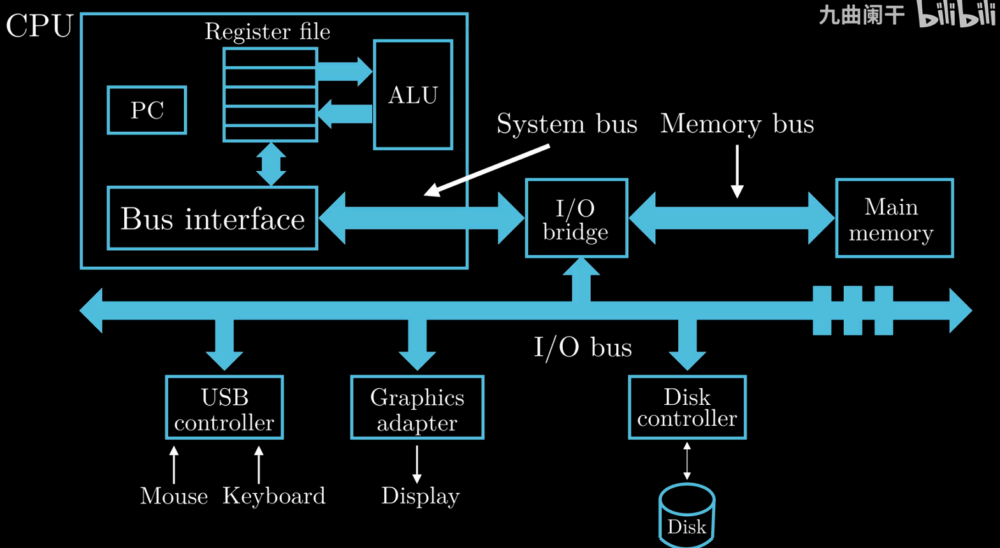

DMA (Direct Memory Access) is usually used for high-spped and bulk data transfers, controlled by system programmers.

- **System Bus** 

    Transfer data in fixed-size blocks called words (4/8 bytes on a 32/64 bit system)

### Memory Hierarchy

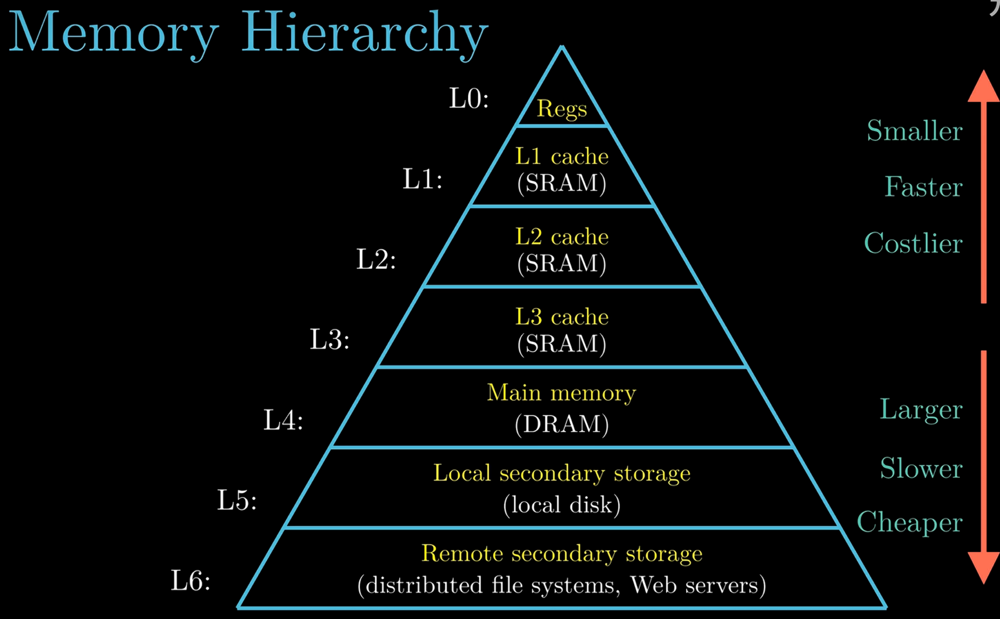

The localities of cache: **Temporal Locality** & **Spatial Locality**.

### Abstractions in Computer Systems (Virtualization)

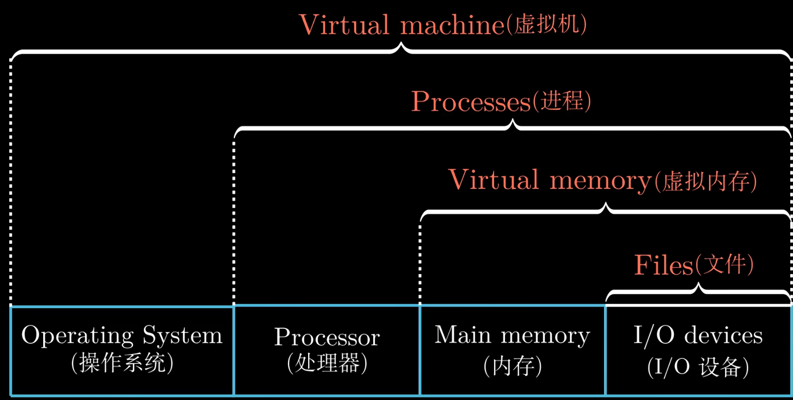

Virtualization is often related to multiplicity, fake versions, and sharing.

- **Process & Thread**

    Multiple processes can run concurrently on the same system, and each process appears to have exclusive use of the hardware. 
    
    Context switching with OS Kernel.

    A process can actually consist of multiple execution units, called threads. Threads shares the same code and global data.

- **Virtual Memory**

    Program Code & Data, Shared Libraries, Heap, Stack, Kernel Virtual Memory from bottom to top.
    
    - Virtual address space canve greater than the  physical memory.

    - Memory serves as a cache for virtaul memory.

    - Support multiprogramming.

    - Allow multiple processes to share data.

- **File**

### Import Themes

#### Amdahl's Law (Quantifying the performance improvement ceiling)

$T_{new} = (1 - \alpha) T_{old} + \frac{\alpha T_{old}}{k} = T_{old} (1 - \alpha + \frac{\alpha}{k})$

$S = \frac{T_{old}}{T_{new}} = \frac{1}{1 - \alpha + \frac{\alpha}{k}}$

#### Concurrency and Parallelism

- **Concurrency** It refers to the general concept of a system having multiple, simultaneous activities, which do not necessarily execute at the same time, but may interleave in time to create the logical impression of simultaneity.

- **Parallelism** It refers to the use of concureency to make a system run faster.

#### ILP and DLP

- **Instruction-Level** e.g. Parallelism pipelining, superscalar, out-of-order execution.

- **Data-Level Parallelism** e.g. Single Insruction Multiple Data (SIMD), Vector instructions.

### Computer Architecture

Computer Architecture (e.g. Intel x86, IBM 360, ARM, RISC-V) is the interface between hardware and software, it includes ISA and Microarchitectures (e.g. Different implementations of the same ISA: Single cycle, Multi-cycle, Pipelined, Superscalar, Out-Of-Order, Speculative Execution, Cache Hierarchies, and Various Predictions).

# Chapter 2 Representing and Manipulating Information

## Information Storage

- **Words**

    $w$ word size $\Longleftrightarrow$ $[0,2^w)$ virtual address space

- **Addressing and Byte Ordering** 

    Big endian (e.g. IBM Mainframes) & Little endian (e.g. Intel x86, ARM, RISC-V).
    
    Big-endian means most significant byte first, and Little-endian means least significant byte first. 

## Integer Representaions

### Sizes of Data Type in C/C++

|Signed|Unsigned|32-bit (Bytes)|64-bit (Bytes)|
|:--:|:--:|:--:|:--:|
|$\texttt{[signed] char}$|$\texttt{unsigned char}$|1|1|
|$\texttt{short}$|$\texttt{unsigned short}$|2|2|
|$\texttt{int}$|$\texttt{unsigned}$|4|4|
|$\texttt{long}$|$\texttt{unsigned long}$|$\color{red}\textbf{4}$|$\color{red}\textbf{8}$|
|$\texttt{int32{\_}t}$|$\texttt{uint32{\_}t}$|4|4|
|$\texttt{int64{\_}t}$|$\texttt{uint64{\_}t}$|8|8|
|$\texttt{char *}$|—|$\color{red}\textbf{4}$|$\color{red}\textbf{8}$|
|$\texttt{float}$|—|4|4|
|$\texttt{double}$|—|8|8|

### Unsigned Encodings

Suppose a vector $\mathrm{x} = [x_{w - 1},x_{w - 2},\cdots,x_0]$, then $\operatorname{B2U_w}(x) = \sum \limits_{i = 0}^{w - 1}x_i \cdot 2^i$

### Two's Complement Encodings

><strong>Inverse form (1's Complement)</strong> For a negative number, keep the signed the same and invert the rest.<br> two zero exits & end-round carry out issues (hte end carry-out bit needs to add back to the LSB)
<br><br>
<strong>2's Complement</strong> For a negative number, keep the sign the same, invert the rest and add 1.

Suppose a vector $\mathrm{x} = [x_{w - 1},x_{w - 2},\cdots,x_0]$, then $\operatorname{B2T_w}(x) = -x_{w - 1} \cdot 2^{w - 1} + \sum \limits_{i = 0}^{w - 2}x_i \cdot 2^i$

### Conversions between Signed and Unsigned

$$
\operatorname{T2U_w}(x) = 
\begin{cases}
x + 2^w,\quad x < 0 \\
x,\quad x \ge 0
\end{cases}
\quad
\operatorname{U2T_w}(u) = 
\begin{cases}
u,\quad x \le Tmax_w\\
u - w^w,\quad x > Tmax_w
\end{cases}
$$

For a $n$-bit 2's complemetn signed binary numeral system:

- Minimum $-2^{n - 1}$, corresponding to binary $\texttt{100} \cdots \texttt{0}$ (A special case that does not satisfy the **invert bits and add 1** rule used for other negative numbers).
- Maximum $2^{n - 1} - 1$, corresponding to binary $\texttt{011} \cdots \texttt{1}$.

### Sign Extension

#### Small to Big

- Zero extension of unsigned numbers

- Sign extension of two's complement numbers

    $\operatorname{B2T_w}([x_{w - 1},x_{w - 2},\cdots,w_0]) = \operatorname{B2T_{w + k}}([x_{w - 1},x_{w - 1},\cdots,x_{w - 1},x_{w - 1},x_{w - 2},\cdots,x_0])$

    Since $\operatorname{B2T_{w + 1}} -\operatorname{B2T_w} = (-x_{w - 1} \cdot 2^w + x_{w - 1} \cdot 2^{w - 1}) - x_{w - 1} \cdot 2^{w - 1} = 0$, by induction, we can proof it.

#### Big to Small

- $\operatorname{B2U_{k}}(x) = \operatorname{B2U_{w}}(x) \bmod 2^k$

- $\operatorname{B2T_{k}}(x) = \operatorname{U2T_{w}}(\operatorname{B2U_{w}}(x) \bmod 2^k)$

## Integer Arithmetic

### Addition

$$
x + y^u_w = 
\begin{cases}
x + y,\quad x + y < 2^w \\
x + y - 2^w,\quad 2^w \le x + y < 2^{w + 1}
\end{cases}
$$

$$
x + y^t_w = 
\begin{cases}
x + y - 2^w,\quad 2^{w - 1} \le x + y\\
x + y,\quad -2^{w - 1} \le x + y < 2^{w - 1} \\
x + y + 2^w,\quad x + y < -2^{w - 1}
\end{cases}
$$

### Additive Inverse

$x + x' = 0\ \text{or}\ 2^w$

$$
-x^u_w = 
\begin{cases}
x,\quad x = 0 \\
2^w - x,\quad x > 0
\end{cases}
\quad
-x^t_w = 
\begin{cases}
x,\quad x > Tmin_w \\
Tmin_w,\quad x = Tmin_w
\end{cases}
$$

- For two numbers A, B, the overflow occurs when `(NOT (sign_A XOR sign_B)) AND (sign_A XOR new_sign) == 1`. (Two operands have the same sign but the result has a different sign.)

- One Bit Full Adder 

    $S_i = A_i + B_i + \text{carry\_in} \quad \text{carry\_out} = (A_i \& B_i) | (\text{carry\_in} \& (A_i \oplus B_i))$

- Carry Lookahead Adder 
    
    $$
    \begin{cases}
    g_i = (A_i \cdot B_i) \\
    p_i = (A_i \oplus B_i) \\
    C_1 = g_0 + (p_0 \cdot C_0) \\
    C_2 = g_1 + (p_1 \cdot g_0) + (p_1 \cdot p_0 \cdot C_0) \\
    C_3 = g_2 + (p_2 \cdot g_1) + (p_2 \cdot p_1 \cdot g_0) + (p_2 \cdot p_1 \cdot p_0 \cdot C_0) \\
    \vdots
    \end{cases}
    $$

    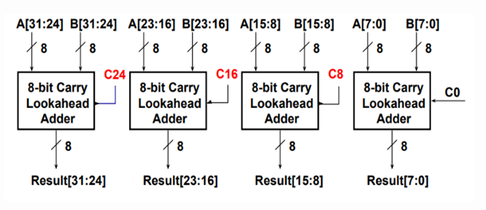

### Multipilication

$$
x \times y^u_w = (x \cdot y) \bmod 2^k \\
x \times y^t_w = \operatorname{U2T_w}((x \cdot y) \bmod 2^k)
$$

### Division (by a power of 2)

Unsigned numbers use **logical shift**, while two's complement numbers use **arithmetic shift** to achieve sign-preserving extension.

Right shift performs integer division by powers of two : 

- $x \le 0 \quad x >> k = \lfloor \frac{x}{2^k} \rfloor$

- $x < 0 \quad (x + (1 << k) - 1) >> k = \lceil \frac{x}{2^k} \rceil$

## Floating Point

### Floating-Point Representation

$V = (-1)^s \times M \times 2^E$

s (sign) : The number is positive ($s=0$) or negative ($s=1$).

M (fraction) : A binary fraction.

E (exponent) : $2^E$ weight.

$\texttt{bias (float)} = 127 \quad \texttt{bias(double)} = 1023$ ($\texttt{bias} = 2^{k - 1} - 1$)

|Category|Exponent $e$|Fraction $f$|Value Formula|
|:--:|:--:|:--:|:--:|
|Normalized|$1 \le e \le 254$|any|$V = (-1)^s \times (f{\color{red} + 1}) \times 2^{\color{red}{e - 127}}$|
|Denormalized|$e = 0$|$f \neq 0$|$V = (-1)^s \times f \times 2^{\color{red}{-126}}$|
|Zero|$e = 0$|$f = 0$|$V = \pm 0.0$|
|Infinity|$e = 255$|$f = 0$|$V = \pm \infty$|
|NaN (Not a Number) |$e = 255$|$f \neq 0$|`NaN`|

#### Comparison (postive number)

|Format|Minimum|Maximum|
|:--:|:--:|:--:|
|Single Precision Normalized <br> $V = (-1)^s \times \overline{1.f} \times 2^{e - 127}$|$e = \texttt{00000001}$ <br> $E_{\min} = -126$ <br> $f = 0$ <br> $V = 1.0 \times 2^{-126}$|$e = \texttt{11111110}$ <br> $E_{\max} = 127$ <br> $f = 0.\underbrace{11\ldots 1}_{23\ \text{ones}}$ <br> $M = 1 + f = 1 + (1 - 2^{-23})$ <br>$V = 1.0 \times 2^{127} \times (2 - 2^{-23}) \approx 3.4 \times 10^{38}(\texttt{0x7F7FFFFF})$|
|Single Precision Denormalized <br> $V = (-1)^s \times \overline{0.f} \times 2^{-126}$|$e = \texttt{00000000}$ <br> $f = 2^{-23}$ <br> $V = 1.0 \times 2^{-149}(\texttt{0x00800000})$|$e = \texttt{00000000}$ <br> $f = 0.\underbrace{11\ldots 1}_{23\ \text{ones}}$ <br> $V = 1.0 \times 2^{-126} \times (1 - 2^{-23})$|

#### Rounding

|Round-down|Round-up|Round-toward-zero|Round-to-even|
|:--:|:--:|:--:|:--:|
|$1.40 \to 1$<br>$-1.5 \to -2$|$1.40 \to 2$<br>$-1.5 \to -1$|$1.40 \to 1$<br>$-1.5 \to -1$|$1.40 \to 1$<br>$1.6 \to 2$<br>$1.5 \to 2$<br>$2.5 \to 2$<br>**Non-midpoint** round to the nearest representable value<br>**Midpoint** choose the $\color{red}\textbf{even}$ one|

#### Floating Point Operations

Lack of Associativity & Lack of Distributivity

<details><summary>Example Questions</summary>

Let $x,f,d$ are of type `int`, `float`, `double` (Their values are arbitrary, except that neither $f$ nor $d$ equals $+\infty$, $-\infty$, or $\texttt{NaN}$.). Then:

- `x == (int)(double) x` True
- `x == (int)(float) x` False $2^{24} - 1 \to (1 + 0.\underbrace{11\ldots 1}_{23\ \text{ones}}) \times 2^{23}$ (e.g. $16777217$)
- `d == (double)(float) d` False (e.g. $1.234$)
- `f == (float)(double) f` True
- `d*d >= 0.0` True

</details>

#### Precision (IEEE 754-2008 Standard Formats)

| Format | Sign Bits | Exponent Bits | Mantissa Bits |
|--------|-----------|---------------|---------------|
| Quad precision | 1 | 15 | 112 |
| Double precision | 1 | 11 | 52 |
| Single precision (FP32) | 1 | 8 | 23 |
| Half precision (FP16) | 1 | 5 | 10 |

<details><summary><strong>bfloat16</strong></summary>

- The format is 1 sign, 8 exponent, 7 mantissa bits, Same exponent range as FP32.
- AI/LLM is based on predictions, approximation does not require high precision.Therefore reduced precision is acceptable for AI.  
- Lower precision format enables higher memory bandwidth and computational. bandwidth.
</details>

#### FMA/FMAC

Fused Multiply and Add (FMA) or Fused Multiply and Accumulate (FMAC) combines multiply and add in one instruction ($A \times B + C$).

- Multiplication and addition are parallel.
- Normalization and rounding are combined at the end.

Use `-mfma -ffp-contract=fast` to enable FMA.

# Chapter 3 Machine-Level Representation of Programs

## Machine-Level Representation of Programs

### RISC [optimized for processor speed]

#### Principles

1. Simplicity favors regularity
2. Smaller is faster
3. Make common cases fast
4. Good design demands good compromises

[RSA should be scalable, flexible, and extensible.]

#### Instruction Types in RV32I

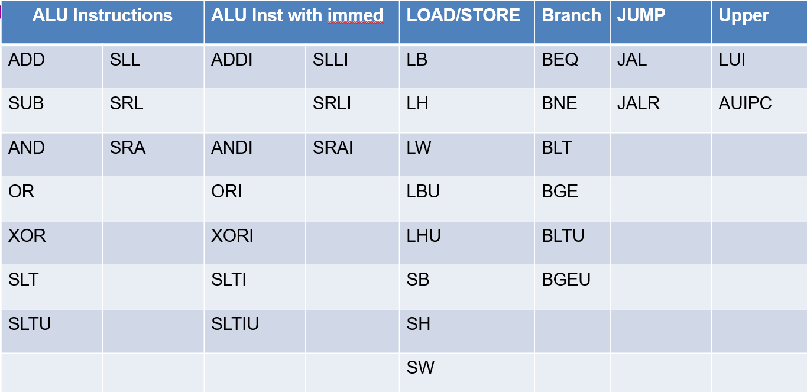

|Types|Instructions|
|:--:|:--:|
|ALU|`add`, `sub`, `and`, `or`, `xor`, `slt`, `sltu`, `sll`, `srl`, `sra`, and all with immediate (No `subi` in RV32I)|
|Control Instructions|`beq`, `bne`, `blt`, `bge`, `bltu`, `bgeu`, `jal`, `jalr`|
|Memory Instructions|`lw` (No `lwu` in RV32I), `lh`, `lb`, `sw`, `sh`, `sb`, `lbu`, `lhu`|
|Privileged Instructions|Interrupt, Memory Management, System Calls, Control and Status Registers (CSR), Mode Change|

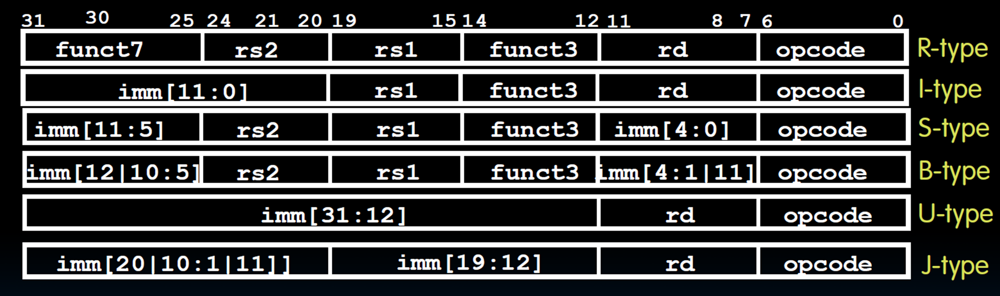

| Format | Name | Instructions |
|--------|------|--------------|
| **R-type** | Register | `add`, `sub`, `sll`, `srl`, `sra`, `xor`, `or`, `and` |
| **I-type** | Immediate | `addi`, `slli`, `srli`, `srai`, `xori`, `ori`, `andi` |
| **I-type** | Load | `lb`, `lh`, `lw`, `lbu`, `lhu` |
| **I-type** | Jump and Link Register | `jalr` |
| **S-type** | Store | `sb`, `sh`, `sw` |
| **B-type** | Branch | `beq`, `bne`, `blt`, `bge`, `bltu`, `bgeu` |
| **U-type** | Upper Immediate | `lui`, `auipc` |
| **UJ-type** | Unconditional Jump | `jal` |

- Three operand instruction format. 
- X0 is always zero.
- 32 means Address cability/Integer register length.
- Immediate

    - **$\texttt{R}$ type** No immediate.
    - **$\texttt{B,I}$ type** 12 bits immediate. Shift instructions are I-type but repurpose the immediate field as a 5-bit shift amount for RV32I (6-bit for RV64I). `inst[30]` distinguishes arithmetic from logical right shift, while `inst[31:26]` are fixed to zero except `inst[30]` (Range: $\pm 4\text{KB}$). The immediate in the **branch** instruction is an offset relative to PC.
    - **$\texttt{S}$ type** The 12‑bit immediate is split into high 7 bits (immediate) and low 5 bits (immed) (maintain regularity). The immediate in the **store** instruction is an offset relative to `rs1`.
    - **$\texttt{J}$ type** 20 bits immediate.
- Jump
    - `jal`

        - $rd \leftarrow PC + 4$, $PC \leftarrow PC + \text{sign-extend}(\{\text{inst}[31], \text{inst}[19:12], \text{inst}[20], \text{inst}[30:21]\})\times 2$ (Jumps are 2-byte aligned, so last bit is implicit zero).
        - Range: $\pm 1\text{MB}$.
        - Beyond 1MB: Use **AUIPC + JALR**.
    - `jalr`

        - $rd \leftarrow PC + 4$, $PC \leftarrow (rs1 + \text{sign-extend}(\text{inst}[31:20])) \ \&\ \sim 1$ ($\sim 1$ clears LSB to ensure 2‑byte alignment). 
- Load and Store

    `lw rd, offset (rs1)` means load data from memory and write into `rd`.

    `sw rs2, offset (rs1)` means store data from register `rs2` into memory.
- LUI loads a 20‑bit immediate into the upper bits of a register; AUIPC adds a 20‑bit immediate to the current PC for position‑independent addressing. 
  <details> <summary>How to load a 32b const into a register?</summary>
  
    1. Use a LW instruction (cost more)
    2. `lui` and `addi` (When the lower 12 bits of a 32‑bit constant are $\ge \texttt{0x800}$, `addi` sign‑extends them, causing an incorrect result. The assembler automatically adjusts the upper 20 bits when using the `li` pseudo‑instruction.) (Range: $4\text{GB}$)

    </details>

<details> <summary><strong>Instruction Encoding List</strong></summary>

<div style="display: grid; grid-template-columns: 1fr 1fr; gap: 10px;">
  <div style="align-self: stretch;">
    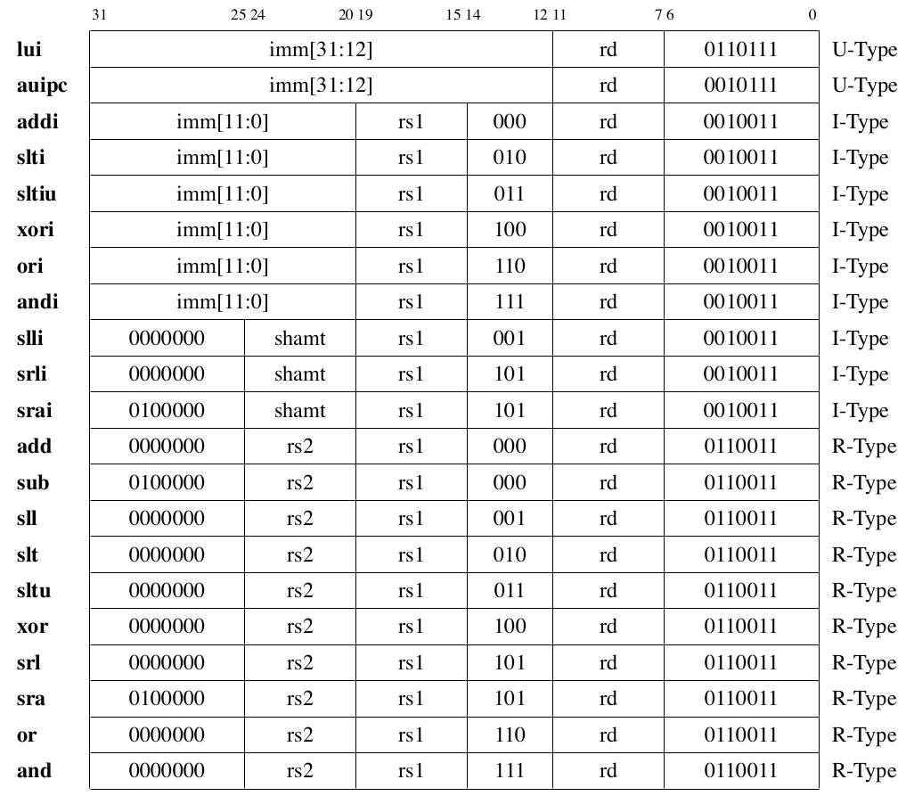
  </div>
  <div style="display: flex; flex-direction: column; gap: 10px;">
    <div style="flex: 1; display: flex; align-items: flex-start;">
      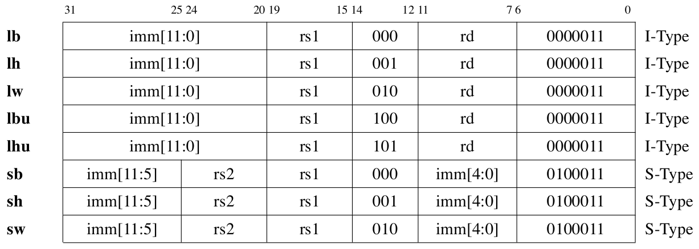
    </div>
    <div style="flex: 1; display: flex; align-items: flex-end;">
      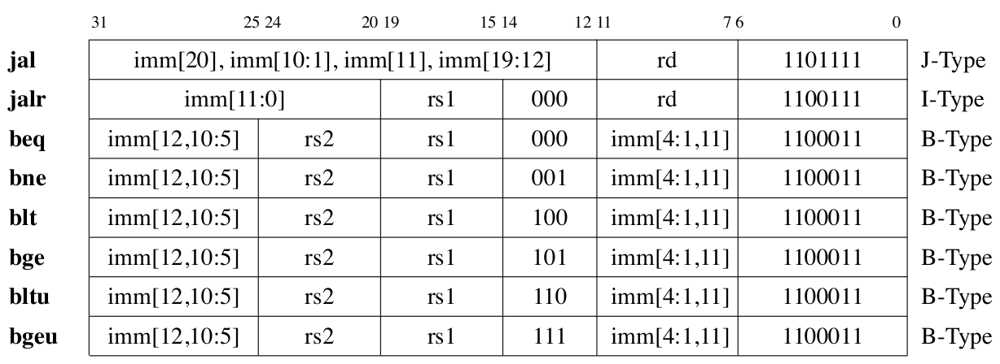
    </div>
  </div>
</div>

</details>

<details><summary><strong>Regularity</strong></summary>
  
| Field | Bit Position | Note |
| :---: | :---: | :---: |
| **Opcode** | $[0,6]$ | Always opcode |
| **rd** | $[7,11]$ | Destination reg |
| **rs1** | $[15,19]$ | Source reg 1 |
| **rs2** | $[20,24]$ | Source reg 2 |
| **Length** | - | Fixed 16/32 bit |
| **Immediate** | High bits | Uses rd field for branch/store |
</details>

<details><summary><strong>Pseudo Instrcution</strong></summary>

| Pseudoinstruction | Actual Instruction Sequence | Operation |
|-------------------|----------------------------|-----------|
| `nop` | `addi x0, x0, 0` | No operation |
| `li rd, imm` | `lui rd, imm[31:12] + imm[11]`<br>`addi rd, rd, imm[11:0]` | Load 32-bit immediate |
| `mv rd, rs` | `addi rd, rs, 0` | Copy register |
| `not rd, rs` | `xori rd, rs, -1` | Bitwise NOT |
| `neg rd, rs` | `sub rd, x0, rs` | Two's complement negation |
| `seqz rd, rs` | `sltiu rd, rs, 1` | Set if $= 0$ |
| `snez rd, rs` | `sltu rd, x0, rs` | Set if $\neq 0$ |
| `sltz rd, rs` | `slt rd, rs, x0` | Set if $< 0$ |
| `sgtz rd, rs` | `slt rd, x0, rs` | Set if $> 0$ |
| `beqz rs, offset` | `beq rs, x0, offset` | Branch if $= 0$ |
| `bnez rs, offset` | `bne rs, x0, offset` | Branch if $\neq 0$ |
| `blez rs, offset` | `bge x0, rs, offset` | Branch if $\le 0$ |
| `bgez rs, offset` | `bge rs, x0, offset` | Branch if $\ge 0$ |
| `bltz rs, offset` | `blt rs, x0, offset` | Branch if $< 0$ |
| `bgtz rs, offset` | `blt x0, rs, offset` | Branch if $> 0$ |
| `bgt rs, rt, offset` | `blt rt, rs, offset` | Branch if $rs > rt$ |
| `ble rs, rt, offset` | `bge rt, rs, offset` | Branch if $rs \le rt$ |
| `bgtu rs, rt, offset` | `bltu rt, rs, offset` | Branch if unsigned $rs > rt$ |
| `bleu rs, rt, offset` | `bgeu rt, rs, offset` | Branch if unsigned $rs \le rt$ |
| `j offset` | `jal x0, offset` | Unconditional jump |
| `jal offset` | `jal x1, offset` | Jump and link (return address in `x1`) |
| `jr rs` | `jalr x0, 0(rs)` | Jump to address in `rs` |
| `jalr rs` | `jalr x1, 0(rs)` | Jump and link to address in `rs` |
| `ret` | `jalr x0, 0(x1)` | Return from subroutine |
| `call offset` | `auipc x1, offset[31:12] + offset[11]`<br>`jalr x1, offset[11:0](x1)` | Far call to subroutine |

</details>

<details><summary>Why do RISC-V loads/stores use <code>base+immediate</code> instead of <code>base+index</code>?</summary>

- **Simpler hardware** Adding scaling to load instructions requires a shifter and complicates the address calculation datapath, increasing cost and cycle time.
- **ISA regularity violation** Three operands `(rs1, rs2, rd)` would force an R‑type format, but R‑type is reserved for ALU operations only. Mixing in memory access would break the clean encoding scheme.
- **Compiler can optimize it away** In loops, the compiler just increments the base register by the element size each iteration, making scaled indexing unnecessary.

</details>

<details><summary>Why do RISC-V instructions place immediate bits in seemingly "random" positions (e.g., B-Type and J-Type)?</summary>

- Fixed sign bit at position 31 across all formats.
- Decoder reuse (B-Type reuses S-Type logic, J-Type reuses U-Type logic).
- Fixed register fields (`rs1`, `rs2`, `rd`) across formats.
</details>

#### Application Binary Interface (ABI)

It is based on three key components : **the computer ISA, the OS, and the calling convention**. ABI incompatibility will occur due to differences between operating systems.

#### Data Alignment

- No cache line crossing; no double TLB (Translation Lookaside Buffer) misses; no double page faults come from a single memory instruction execution. 

- Better cache line utilization.

RISC-I to RISC-V **do not** explicitly enforce data alignments. But their compilers often enforce data alignments.

**Crossing a boundary makes the memory reference difficult to handle.** The hardware needs to go through two exceptions instead of one.

**Padding Rule**
- Internal Padding Every member must start at an address that is a multiple of its own alignment requirement.
- Trailing Padding The total size of the struct must be a multiple of the largest alignment requirement among its members.

<details><summary>Exercise</summary>

```c
struct S1 {
    int white;
    long long count;
    char c;
    int red;
    int blue;
} A[];
```
Suppose $A$ is an array of structure $S1$, and the starting address of $A$ is stored in register $X1$. what instruction should be used to access `A[100].red`?

| Member | Size | Start | Padding | End | Reason |
|--------|------|-------|---------|-----|--------|
| `white` | $4$ | $0$ | $0$ | $3$ | `int` aligns at $4$ |
| `count` | $8$ | $8$ | $+4$ | $15$ | needs 8-byte align, $4$ pad $4$ to $8$ |
| `c` | $1$ | $16$ | $0$ | $16$ | `char` aligns at $1$ |
| `red` | $4$ | $20$ | $+3$ | $23$ | needs 4-byte align, $17$ pad $3$ to $20$ |
| `blue` | $4$ | $24$ | $0$ | $27$ | `int` aligns at $4$ |

Current size is $28$. Largest alignment in struct is $8$, $28$ is not a multiple of $8$, so pad $4$ bytes at the end. Total struct size is $32$ bytes.

`A[100].red` : $X1 + 100 \times 32 + 20 = X1 + 3220$, so the answer is `LW X2, 3220(X1)`.

</details>

#### Stack / Frame Alignments

- Defined by ABI (e.g., RISC‑V psABI: 16‑byte)
- CRT aligns `sp` before `main ()`

#### Compiler Reordering

- Independent Variables (Rearrangement Allowed)

- Struct Fields (Rearrangement Forbidden)
    - Binary compatibility
    - Pointer arithmetic
    - Interoperability

#### PC-relative Addressing

Branch instructions use PC‑relative addressing with a 12‑bit signed offset (in 2‑byte units). Since branch targets are always multiples of 2, encoding in 2‑byte units doubles the reachable range without losing information.

$$
\text{Target Address} = \text{PC} + \text{sign\_extend}(12\text{-bit immediate}) \times 2
$$

#### CSR

| Name | Abbreviation | Description |
|------|--------------|-------------|
| Machine Trap-Vector Base-Address Register | `mtvec` | Exception handler entry address |
| Machine Status Register | `mstatus` | Global interrupt enable (MIE) and status |
| Machine Cause Register | `mcause` | Reason of last exception/interrupt |
| Machine Exception Program Counter | `mepc` | Saves PC when exception occurs |
| Machine Interrupt Enable Register | `mie` | Enables specific interrupt sources |
| Machine Interrupt Pending Register | `mip` | Shows pending interrupts |

#### Exception Handling

1. **Save context** Save current PC value to `mepc` register
2. **Update status** Update `mstatus`, disable further interrupts (clear MIE bit) to prevent nesting
3. **Set cause** Write exception/interrupt reason to `mcause`
4. **Jump to handler** Jump to exception handler entry point based on `mtvec` configuration

#### Calling Convention

| RV Registers | ABI Name | Caller/Callee | Purpose |
|---|---|---|---|
| x0 | `zero` | — | Always zero |
| x1 | `ra` | Caller | Return address |
| x2 | `sp` | Callee | Stack pointer |
| x3 | `gp` | — | Global pointer |
| x4 | `tp` | — | Thread pointer |
| x5–x7 | `t0`–`t2` | Caller | Temporary registers |
| x8 | `s0` / `fp` | Callee | Saved register / Frame pointer |
| x9 | `s1` | Callee | Saved register |
| x10–x11 | `a0`–`a1` | Caller | Arguments / Return values |
| x12–x17 | `a2`–`a7` | Caller | Arguments |
| x18–x27 | `s2`–`s11` | Callee | Saved registers |
| x28–x31 | `t3`–`t6` | Caller | Temporary registers |

Leaf routines use args & caller‑saved only (no save/restore any registers).  

<details> <summary>Why <strong>caller</strong> registers are allocated to temporaries?</summary>
Temporaries are short-lived and do not need to survive across function calls.  Placing them in caller‑save registers avoids unnecessary save/restore code.
</details>

<details> <summary>Why <strong>callee</strong> registers are allocated to local variables?</summary>
Local variables live across function calls. Using callee registers ensures they are preserved automatically by the callee, avoiding repeated saves at each call site.
</details>

<details> <summary>Why <strong>callee</strong> registers are allocated to CSEs (Common Sub-Expressions)?</summary>
Local variables and CSEs are tend to live longer (may be as long as the procedure invocation).
</details>

### CISC [optimized for compact code size]

# Chapter 4 Processor Architecture & Logic Design

## Logic Designs

### Major components

- Combinational element
- State (Sequential) elements $\text{Write} = 0$, cannot write to register (**B-type and S-type**).
- Clock signals

<details> <summary>What is the difference between combinational logic and sequential logic?</summary>

The former one is stateless, output purely depends on the inputs (e.g. ALU). The latter one has states, output depends on the inputs and the states (e.g. register).

</details>

The propagation delay of a combinational circuit is determined by the delay of the critical path, which is the longest path of logic gates from any input to any output.

## Processor

### Core

#### Data Path (Data Flow) 

e.g. ALU, Register, Memory interface, Buses.

#### Control (Instruction Flow) 

e.g. PC, Instruction fetch, and Control signal generation.

#### RV32I Data Path and Control

- **Memory reference instrutions** `lw`, `sw`
- **Arithmetic/logical instrutions** `add`, `sub`, `and`, `or`
- **Control flow instruction** `beq`, `jal`

### Instruction Execution Cycle

#### Cycle

- **Three Stages**
    - **Fetch** Use the PC to supply the instruction address and fetch the instruction from memory.
    - **Decode** Decode the instruction (and read registers).
    - **Execute** 
        - Use ALU to calculate (Arithmetic result & Memory address for load/store & branch target address)
        - Access data memory for load/store
        - Update PC (target address or PC + 4 (next word) or PC + 2 (if using compressed instructions RV32IC))

- **Multi-cycle** Instructions are broken down into multiple steps, each taking **one** clock cycle. 

#### Time

CPU time is determined by the following:

$$
\text{CPU Time} = \text{Instructions count} \times \text{Cycles per instruction (CPI)} \times \text{Clock cycle time}
$$

Program execution time is determined by the following:

$$
\frac{\text{time}}{\text{program}} = \frac{\text{instructions}}{\text{program}} \times \frac{\text{cycles}}{\text{instructions}} \times \frac{\text{time}}{\text{cycle}}
$$

- **CISC machines** Lower instruction count, higher CPI, longer cycle time
- **RISC machines** Higher instruction count, lower CPI, shorter cycle time

### Abstract View of RV32I Subset

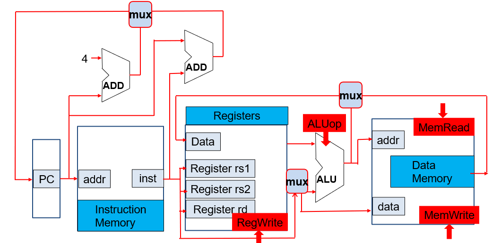

<details><summary> How to select between <code>PC+4</code> and <code>PC+immediate</code>?</summary>

If a branch is taken or a jal instruction, select `pc+immed`. Otherwise select `PC+4`.

</details>

<details><summary> How to select data from the memory or the ALU?</summary>

If load select `Mem`. If R-type select `ALU`.

</details>

<details><summary> How to select data from Immediate or <code>reg[rs2]</code>?</summary>

If R-type select `rs2`. If I-type select `immed`.

</details>

### Processor Designs

1. Analyze the requirements
2. Data Path Requirements selections
   
   - **Combinational Components** Adder & MUX & ALU (An adder only does addition (e.g., PC+4). An ALU includes an adder but also performs many other arithmetic/logic operations.) 

   - **Sequential Components** 
       
        Register $N$-bit storage with Write Enable control. Updates only at clock tick if $\text{Write} = 1$. 
        
        Register File consists of 32 registers with two read ports (rs1/rs2) and one write port (rd).

        Memory. Read ($\text{WE}=0$): Address → Data Out. Write ($\text{WE}=1$): Next clock tick, Data In → Address.

    - **Assemble**

        - **Instruction Fetch Unit** Fetch the instruction and Update the program counter.

        - **Branch Operations** Using ALU subtraction for branches risks overflow corrupting the sign, so RISC-V processors internally use flags (overflow and carry) or dedicated comparators for correct branch decisions without hardware traps.
        
        - **Add and Subtract** `R[rd] <- R[rs1] op R[rs2]`
        
        - **Load/Store Operations** A single ALU and register file need two multiplexers: one for ALU's second input (e.g. `add rd, rs1, rs2` and `addi rd, rs1, imm`), another for register file's write data source (e.g. `add x3, x1, x2` from ALU and `lw x3, 8(x1)` from memory).

    - **Control Points and Signals** 

        |Control Signal|Description|Expression|
        |:--:|:--:|:--:|
        |`PCsrc`|Select the next PC value <br>PC + 4 [$0$] <br>Branch / jump target address [$1$]|`(Branch or jal/jalr) ? 1 : 0`|
        |`RegWr`|Write enable for register file|`(Branch or Store) ? 0 : 1`|
        |`MemRd`|Enable signal for reading data memory|`Load ? 1 : 0`|
        |`MemWr`|Enable signal for writing data memory|`Store ? 1 : 0`|
        |`ALUsrc`|Select the second ALU input <br> register [$0$] <br> immediate value [$1$]|`R-type ? 0 : 1`|
        |`ALUctr`|Determines the ALU operation|/|
        |`WBsel`|Selects the data written to the register file <br> memory data [$0$] <br> ALU result [$1$] <br> PC + 4 [$2$]|`Load: 0; R-type : 1; jal/jalr : 2`|

On each clock cycle, the single‑cycle processor executes one instruction. State elements update at the rising edge using combinational logic outputs computed during the cycle.

### Control

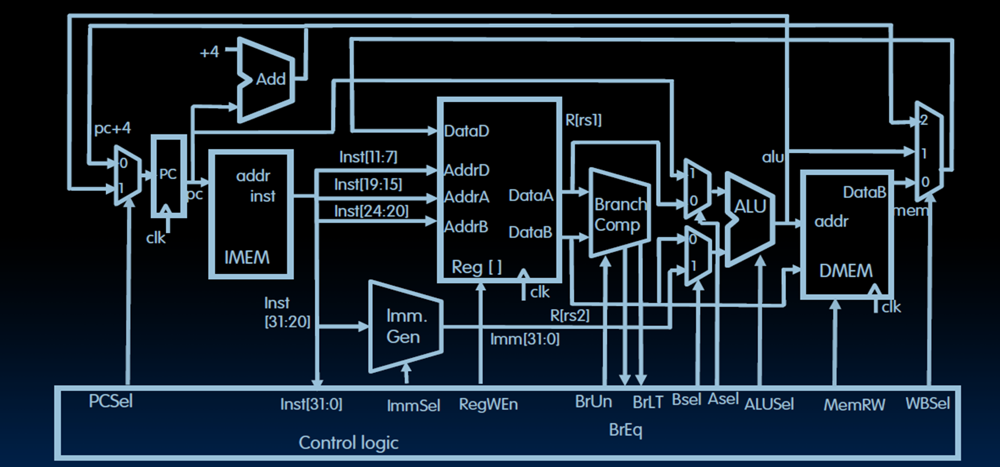

- `Asel` `rs1` or `pc` (When use `jal`, the target is `PC + offset`.)
- `Bsel` `rs2` or `immed`.

<details> <summary> Why does RV32I still need a dedicated Branch Comparator despite having an ALU? </summary>

- Use Branch Comparision to avoid substruction overflow.
- RV32I lacks architectural flags, it requires a dedicated comparator to enable single-cycle compare-and-branch operations by combining comparison and jump logic.   

</details>

## Pipelining

### Five Stages

1. $\text{IF}$ Instrcution fetch from (instruction) memory
2. $\text{ID}$ Instrcution decode & register read
3. $\text{EX}$ Execute operation or calculate address
4. $\text{MEM}$ Access (data) memory operand
5. $\text{WB}$ Write the result back to **register**

|Instructions|Detailed Stages|
|:--:|:--:|
|R-Type, I-Type, `jal`, `jarl`, `lui`, `auipc`|$\text{IF} \to \text{ID} \to \text{EX} \to \text{WB}$ (no $\text{MEM}$)|
|Store, Branch| $\text{IF} \to \text{ID} \to \text{EX} \to \text{MEM}$ (no $\text{WB}$)|
|Load|$\text{IF} \to \text{ID} \to \text{EX} \to \text{MEM} \to \text{WB}$|

- Throughput increases as more instructions complete per unit time, but single instruction latency (The time it takes for each instruction to be executed.) does not decrease and may even increase. 
- Pipeline rate is limited by the slowest stage.
- Potential/ideal speedup = Number of pipeline stages (number of pipeline steps).

### Pipeline-oriented ISA Design

- All instructions are fixed length.
- Few and regular instruction formats.
- Only load/store instructions accessing memory.
- Instructions are simple.

### Single Cycle & Multi Cycle & Pipeline

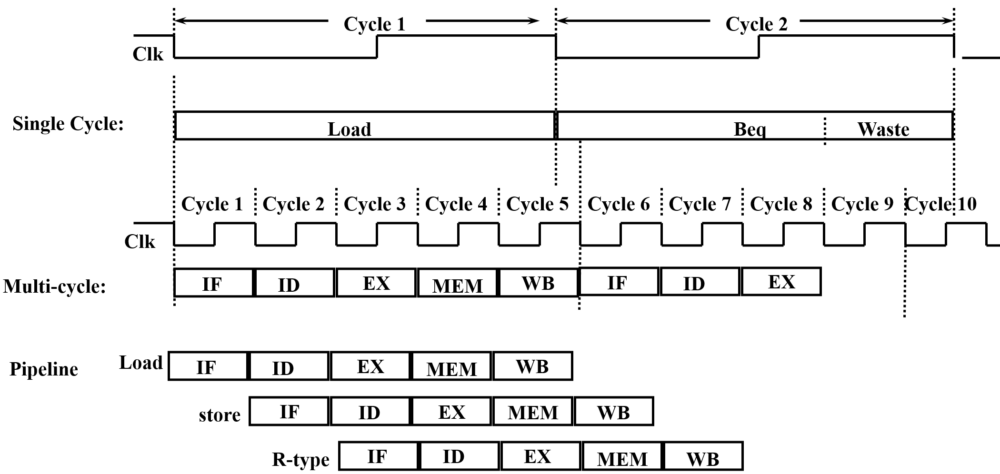

|Implementation|Clock Cycle Time|Instruction Latency|
|:--:|:--:|:--:|
|Single-Cycle|Sum of all stage latencies| 1 $\times$ Clock Cycle Time|
|Multi-Cycle|Longest stage latency|CPI $\times$ Clock Cycle Time|
|Pipelined|Longest stage latency|Number of Stages $\times$ Clock Cycle Time|

### Latency

- Stall
- Long latency pipline (Subsequent instructions can continue to proceed)
  
No arithmetic exceptions allow **out‑of‑order retirement**, avoiding stalls for long‑latency instructions.

### Pipline Registers

Without pipeline registers, stages would overwrite each other’s data, causing instruction mix‑ups and loss of control information.

|Pipeline Register|Stored Information|
|:--:|:--:|
|IF/ID|`PC_ID`, `inst_ID` (instrcution code like opcode) |
|ID/EX|`PC_EX`, `inst_EX`, `imm_EX`, `rs1_EX`, `rs2_EX`|
|EX/MEM|`PC_MEM`, `inst_MEM`, `rs2_MEM`, `alu_MEM`|
|MEM/WB|`PC+4_WB` (`rd = PC + 4`), `inst_WB`, `alu_WB`, `mem_WB`|

- Control signals are derived from instruction bits, that is, after the ID stage.
- Control information for later stages are also stored in the pipeline registers.

- **Architecture States** (visible to the programmer and compiler)

    - Registers (**general purpose**, fp, vector, flags)
    - PC
    - Memory
    
    It was saved during a context switch:
    
    - **user-level switch** (e.g. procedure call) saved on the runtime program stack (caller and callee convention).
    - **system-level switch** (e.g. process switch) saved on the Process Control Block (PCB) or the kernel stack.

- **Micro-architecture states**
    - $\red{\text{Piplined registers}}$ Pipelined registers hold transient data between stages for a few cycles.
    - Branch predictors

        Static prediction: backward taken (like loop, back to the lower address), forward not taken.
    - Caches
    - Buffers and Quenes
    - Counters


## Hazards

### Structure Hazards

A conflict arising due to hardware resourece limitations within the pipeline.

- Pipeline stalls
- Multiple resources
- Instruction Reordering 
    
    Static scheduling (by compiler) reorders instructions at compile time to avoid hazards, while dynamic scheduling (by hardware) reorders them at runtime based on actual data and resource availability.
- ISA design

### Data Hazards

A conflict arising because the current instruction depends on the result of a previous instruction that has not yet been computed or written back.

|Scenario|Data Ready Stage|Data Used Stage|Example|
|:--:|:--:|:--:|:--:|
|Register Access Issues|$\texttt{EX}$|$\texttt{ID}$ <br>It bypasses the ALU, read in ID and held until MEM for memory write.|`add t0, t1, t2`<br> `sw t0, 4(t3)`|
|ALU Result Access Issue|$\texttt{EX}$|$\texttt{EX}$|`add s0, t0, t1` <br> `sub t2, s0, t0`|
|Load Hazard|$\texttt{MEM}$|$\texttt{EX}$|`lw s1, 4(s0)`<br>`add t0, s1, t1`|

#### Solutions

Flow dependence (RAW) is a true data dependence, while anti-dependence (WAR) and output dependence (WAW) are name dependences that can be eliminated by register renaming.

- **Stall pipeline (Interlocking)** 

- **Data Forwarding (Bypassing)** 

    Add forwarding control logic to make extra connections in the datapath.

    Hazard detection compares $\texttt{EX/MEM}$ and $\texttt{MEM/WB}$ destination registers with current instruction’s source registers. Forwarding is skipped when `RegWr == 0` or when the destination register is `x0`.

- **Compiler Code Transformations** Scheduling (reordering) scope is often limited by branches, indirect branches, and call/ret.
  
### Control Hazards